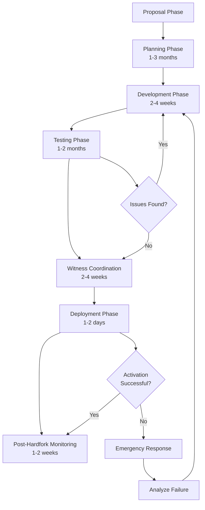
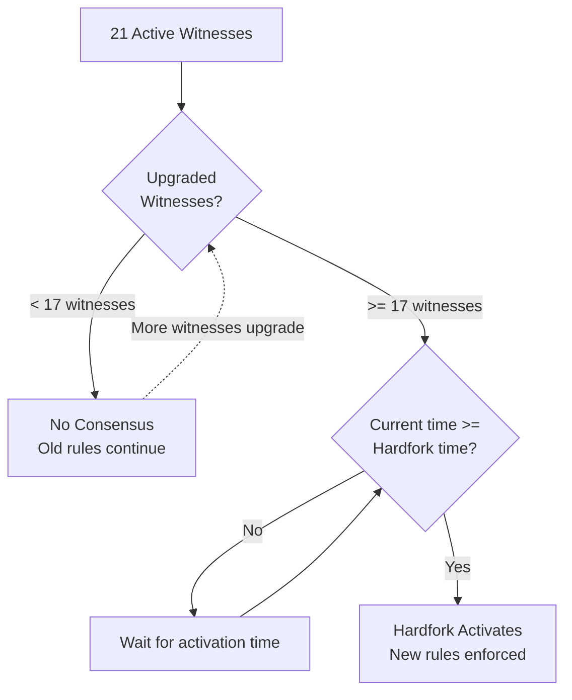
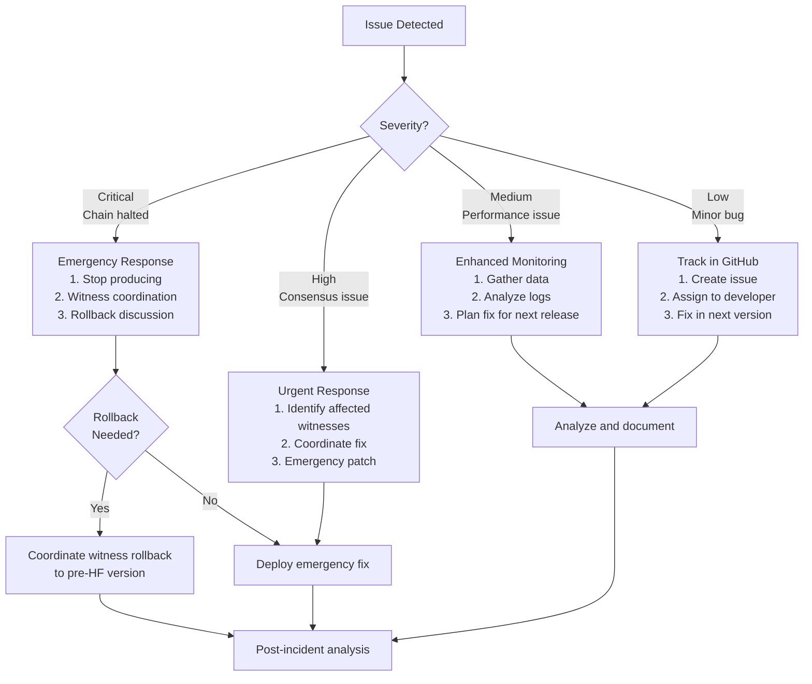

# Steem Blockchain Hardfork Procedure

This document describes the complete procedure for planning, implementing, testing, and deploying a hardfork on the Steem blockchain, with specific reference to Hardfork 19 as a case study.

## Table of Contents

1. [Overview](#overview)
2. [Hardfork Basics](#hardfork-basics)
3. [Planning Phase](#planning-phase)
4. [Development Phase](#development-phase)
5. [Testing Phase](#testing-phase)
6. [Witness Coordination](#witness-coordination)
7. [Deployment Phase](#deployment-phase)
8. [Post-Hardfork Monitoring](#post-hardfork-monitoring)
9. [Case Study: Hardfork 19](#case-study-hardfork-19)
10. [Troubleshooting](#troubleshooting)

## Overview

A hardfork is a **backwards-incompatible protocol change** that requires all nodes on the network to upgrade to the new version. In Steem, hardforks are coordinated through a decentralized witness consensus mechanism.

### Key Principles

- **Consensus-driven**: At least 67% (17 out of 21) of active witnesses must upgrade
- **Time-based activation**: Hardforks activate at a specific timestamp, not block height
- **Backwards-incompatible**: Old nodes cannot process blocks after the hardfork
- **Extensively tested**: Multiple rounds of testnet validation before mainnet deployment

### Hardfork Lifecycle



## Hardfork Basics

### What Changes Require a Hardfork?

**Requires Hardfork:**
- New transaction types or operations
- Changes to consensus rules
- Modifications to block validation logic
- Changes to economic parameters (reward curves, inflation)
- Database schema changes affecting consensus
- Smart Media Token (SMT) protocol changes

**Does NOT Require Hardfork:**
- API changes
- Plugin additions or modifications
- Performance optimizations (if consensus-neutral)
- UI/UX improvements
- Documentation updates

### Hardfork Version Numbering

Steem uses a semantic versioning scheme: `MAJOR.MINOR.PATCH`

- **MAJOR**: Hardfork number (e.g., 0.19.x for HF19)
- **MINOR**: Hardfork version (increments with each hardfork)
- **PATCH**: Bug fixes and non-consensus changes

Example: `0.19.3` = Hardfork 19, patch version 3

### Consensus Mechanism



## Planning Phase

### 1. Proposal and Community Discussion

**Duration:** 1-3 months

**Activities:**
- Identify problems or improvements needed
- Draft initial proposal document
- Present to community via Steemit blog posts
- Gather feedback from witnesses, developers, and users
- Refine proposal based on community input

**Example: Hardfork 19 Proposal**
- **Goal**: Make rewards more fair and linear
- **Problem**: Exponential voting power creates inequality
- **Solution**: Linear reward curve based directly on Steem Power

### 2. Technical Specification

**Create detailed specification including:**

```markdown
## Hardfork N Specification

### Overview
[Brief description of changes]

### Motivation
[Why is this change needed?]

### Technical Changes
1. Change to file X, line Y
2. New operation: operation_name
3. Modified validation logic in Z

### Economic Impact
- Impact on rewards
- Impact on inflation
- Impact on token holders

### API Changes
- New API methods
- Modified API methods
- Deprecated API methods

### Database Changes
- New objects/indexes
- Schema migrations

### Backwards Compatibility
- Breaking changes
- Migration path for existing data
```

### 3. Issue Tracking

**Create GitHub issues for all hardfork-related work:**

```
Title: [HF19] Implement linear reward curve
Labels: hardfork, consensus, priority-high
Milestone: Hardfork 19

Description:
Implement linear reward curve as specified in HF19 proposal.

Changes required:
- [ ] Modify reward calculation in database.cpp
- [ ] Update comment_cashout_evaluator
- [ ] Add STEEM_HARDFORK_0_19 guards
- [ ] Update tests
- [ ] Update documentation

Related Issues: #822, #876, #971
```

## Development Phase

### 1. Code Structure

Hardfork definitions are stored in `libraries/protocol/hardfork.d/`:

```
hardfork.d/
├── 0-preamble.hf        # Header, auto-generated warning
├── 0_1.hf               # Hardfork 1 definition
├── 0_2.hf               # Hardfork 2 definition
├── ...
├── 0_19.hf              # Hardfork 19 definition
└── 0_20.hf              # Hardfork 20 definition
```

### 2. Creating a New Hardfork Definition

**File: `libraries/protocol/hardfork.d/0_19.hf`**

```cpp
#ifndef STEEM_HARDFORK_0_19
#define STEEM_HARDFORK_0_19 19

// Activation timestamp (MUST be in the future when released)
#define STEEM_HARDFORK_0_19_TIME 1497970800 // Tue, 20 Jun 2017 15:00:00 UTC

// Issue numbers that are part of this hardfork
#define STEEM_HARDFORK_0_19__822  (STEEM_HARDFORK_0_19)
#define STEEM_HARDFORK_0_19__876  (STEEM_HARDFORK_0_19)
#define STEEM_HARDFORK_0_19__971  (STEEM_HARDFORK_0_19)
#define STEEM_HARDFORK_0_19__977  (STEEM_HARDFORK_0_19)
#define STEEM_HARDFORK_0_19__987  (STEEM_HARDFORK_0_19)
#define STEEM_HARDFORK_0_19__997  (STEEM_HARDFORK_0_19)
#define STEEM_HARDFORK_0_19__1051 (STEEM_HARDFORK_0_19)
#define STEEM_HARDFORK_0_19__1052 (STEEM_HARDFORK_0_19)
#define STEEM_HARDFORK_0_19__1053 (STEEM_HARDFORK_0_19)

// Version identifier
#define STEEM_HARDFORK_0_19_VERSION hardfork_version( 0, 19 )

// Hardfork-specific constants
#define STEEM_HF_19_RECENT_CLAIMS (fc::uint128_t(uint64_t(140797515942543623ull)))
#define STEEM_HARDFORK_0_19_ACTUAL_TIME (fc::time_point_sec(1497970809))
#define STEEM_HF_19_SQRT_PRE_CALC (fc::time_point_sec( STEEM_HARDFORK_0_19_ACTUAL_TIME - STEEM_CASHOUT_WINDOW_SECONDS ))

#endif
```

### 3. Update Hardfork Count

**File: `libraries/protocol/hardfork.d/0-preamble.hf`**

```cpp
#ifdef IS_TEST_NET
#define STEEM_NUM_HARDFORKS 21  // Testnet may have more hardforks
#else
#define STEEM_NUM_HARDFORKS 19  // Mainnet hardfork count
#endif
```

### 4. Generate Hardfork Header

The hardfork definitions are compiled into a single header file:

```bash
# From steem root directory
cd libraries/protocol
python3 -m steem_build_helpers.cat_parts
```

This generates `include/steem/protocol/hardfork.hpp` from all `.hf` files.

### 5. Implementing Consensus Changes

**Guard all hardfork-specific code with hardfork checks:**

```cpp
// Example: Reward calculation change in HF19
void database::update_comment_reward( const comment_object& comment )
{
    if( has_hardfork( STEEM_HARDFORK_0_19 ) )
    {
        // New linear reward curve
        reward = calculate_linear_reward( comment );
    }
    else
    {
        // Old exponential reward curve
        reward = calculate_exponential_reward( comment );
    }
}
```

**Common patterns:**

```cpp
// Conditional logic
if( has_hardfork( STEEM_HARDFORK_0_19 ) )
{
    // New behavior
}

// Operation validation
void validate_operation::operator()( const comment_operation& op ) const
{
    FC_ASSERT( op.author.size() > 0, "Author must not be empty" );

    if( _db->has_hardfork( STEEM_HARDFORK_0_19 ) )
    {
        // Additional validation for HF19+
        FC_ASSERT( op.permlink.size() <= 256, "Permlink too long" );
    }
}

// New operations (only valid after hardfork)
void claim_reward_balance_evaluator::do_apply( const claim_reward_balance_operation& op )
{
    FC_ASSERT( _db->has_hardfork( STEEM_HARDFORK_0_19 ),
               "claim_reward_balance_operation requires HF19" );

    // Operation implementation
}
```

### 6. Database Migrations

For schema changes:

```cpp
void database::init_hardforks()
{
    _hardfork_times[ 0 ] = fc::time_point_sec( 0 );

    // ... other hardforks ...

    FC_ASSERT( STEEM_HARDFORK_0_19_TIME > STEEM_HARDFORK_0_18_TIME,
               "Hardfork times must be increasing" );
    _hardfork_times[ STEEM_HARDFORK_0_19 ] = fc::time_point_sec( STEEM_HARDFORK_0_19_TIME );
}

void database::process_hardforks()
{
    while( _hardfork_times[ _current_hardfork_version.minor + 1 ] <= head_block_time() )
    {
        // Apply next hardfork
        _current_hardfork_version.minor++;

        if( _current_hardfork_version.minor == STEEM_HARDFORK_0_19 )
        {
            // Perform HF19-specific migrations
            perform_hf19_migration();
        }
    }
}

void database::perform_hf19_migration()
{
    // Example: Reset reward curves
    const auto& props = get_dynamic_global_properties();
    modify( props, [&]( dynamic_global_property_object& p )
    {
        p.recent_claims = STEEM_HF_19_RECENT_CLAIMS;
        p.reward_pool = asset( 0, STEEM_SYMBOL );
    });

    // Update all pending rewards
    // ... migration logic ...
}
```

### 7. Writing Tests

**Create comprehensive test coverage:**

```cpp
// tests/tests/operation_tests.cpp

BOOST_AUTO_TEST_SUITE(hardfork_19_tests)

BOOST_AUTO_TEST_CASE( linear_rewards_test )
{
    try
    {
        BOOST_TEST_MESSAGE( "Testing linear reward curve after HF19" );

        ACTORS( (alice)(bob)(carol) )
        generate_block();

        // Fund accounts
        fund( "alice", ASSET( "10.000 STEEM" ) );
        vest( "alice", ASSET( "1000.000 STEEM" ) );

        // Create content before HF19
        comment_operation comment;
        comment.author = "alice";
        comment.permlink = "test-post";
        comment.body = "test content";

        signed_transaction tx;
        tx.operations.push_back( comment );
        tx.set_expiration( db->head_block_time() + STEEM_MAX_TIME_UNTIL_EXPIRATION );
        push_transaction( tx, alice_private_key );

        // Activate HF19
        generate_blocks( STEEM_HARDFORK_0_19_TIME );

        BOOST_REQUIRE( db->has_hardfork( STEEM_HARDFORK_0_19 ) );

        // Test linear reward calculation
        vote_operation vote;
        vote.voter = "bob";
        vote.author = "alice";
        vote.permlink = "test-post";
        vote.weight = 10000; // 100%

        tx.clear();
        tx.operations.push_back( vote );
        push_transaction( tx, bob_private_key );

        // Verify linear rewards
        const auto& comment_obj = db->get_comment( "alice", string("test-post") );
        auto reward = calculate_expected_linear_reward( comment_obj );

        BOOST_REQUIRE_EQUAL( comment_obj.net_rshares, reward );
    }
    FC_LOG_AND_RETHROW()
}

BOOST_AUTO_TEST_CASE( claim_reward_balance_operation_test )
{
    try
    {
        BOOST_TEST_MESSAGE( "Testing claim_reward_balance_operation requires HF19" );

        ACTORS( (alice) )
        generate_block();

        // Try to use operation before HF19 (should fail)
        claim_reward_balance_operation op;
        op.account = "alice";
        op.reward_steem = ASSET( "1.000 STEEM" );

        REQUIRE_OP_VALIDATION_FAILURE( op, "requires HF19" );

        // Activate HF19
        generate_blocks( STEEM_HARDFORK_0_19_TIME );

        // Now it should work
        REQUIRE_OP_VALIDATION_SUCCESS( op );
    }
    FC_LOG_AND_RETHROW()
}

BOOST_AUTO_TEST_SUITE_END()
```

### 8. Building for Testing

```bash
# Build with testnet support (allows scheduling hardforks)
mkdir build && cd build
cmake -DCMAKE_BUILD_TYPE=Release \
      -DBUILD_STEEM_TESTNET=ON \
      -DLOW_MEMORY_NODE=OFF \
      ..

make -j$(nproc) steemd
make -j$(nproc) chain_test
make -j$(nproc) cli_wallet
```

## Testing Phase

### 1. Unit Testing

```bash
# Run all tests
./tests/chain_test

# Run hardfork-specific tests
./tests/chain_test --run_test=hardfork_19_tests

# Run with verbose output
./tests/chain_test --run_test=hardfork_19_tests --log_level=all
```

### 2. Debug Node Testing

**Using Python Debug Node:**

```python
#!/usr/bin/env python3
# test_hf19.py

from steemdebugnode import DebugNode
from steemapi import SteemClient
import time

# Initialize debug node
steemd_path = "programs/steemd/steemd"
data_dir = "witness_node_data_dir"

debug_node = DebugNode(steemd_path, data_dir)

with debug_node:
    client = SteemClient()

    # Get current state
    props = client.get_dynamic_global_properties()
    print(f"Current hardfork: {props['hardfork_version']}")
    print(f"Current block: {props['head_block_number']}")

    # Schedule HF19
    current_time = props['time']
    hf19_time = int(time.time()) + 300  # 5 minutes from now

    debug_node.debug_generate_blocks_until(
        debug_node.debug_get_head_block_number() + 10,
        hf19_time
    )

    # Verify hardfork activated
    props = client.get_dynamic_global_properties()
    assert props['hardfork_version'] == '0.19.0', "HF19 not activated"

    # Test linear rewards
    # ... test logic ...

    print("HF19 tests passed!")
```

**Run the test:**

```bash
python3 test_hf19.py
```

### 3. Private Testnet Setup

**Create a private testnet configuration:**

```ini
# testnet_config.ini

# Reduce witness requirement for testing
witness-required-for-hardfork = 1

# Fast block production
plugin = witness
witness = "init0"
witness = "init1"
witness = "init2"

private-key = 5JNHfZYKGaomSFvd4NUdQ9qMcEAC43kujbfjueTHpVapX1Kzq2n

# Enable debug node for manipulation
plugin = debug_node

# P2P (if testing network)
p2p-endpoint = 0.0.0.0:12001
seed-node =

# API endpoints
webserver-http-endpoint = 0.0.0.0:18091
webserver-ws-endpoint = 0.0.0.0:18090

# Fast testing
enable-stale-production = true
required-participation = 0

# Testnet chain ID
chain-id = 46d82ab7d8db682eb1959aed0ada039a6d49afa1602491f93dde9cac3e8e6c32

# Hardfork schedule (accelerated for testing)
hardfork-schedule = 0.19.0:300  # HF19 at block 300
```

**Launch private testnet:**

```bash
# Initialize blockchain
./programs/steemd/steemd --data-dir=testnet_data --genesis-json=testnet_genesis.json

# Run testnet
./programs/steemd/steemd --data-dir=testnet_data --config-file=testnet_config.ini
```

### 4. Public Testnet Coordination

**Testnet Schedule (Example for HF20):**

| Date | Activity |
|------|----------|
| Week 1 | Initial testnet deployment, frequent reboots expected |
| Week 2-3 | Stability testing, witness participation |
| Week 4-6 | Full integration testing with applications |
| Week 7-8 | Final validation, no code changes |

**Testnet Participation:**

```bash
# Connect to public testnet
./programs/steemd/steemd \
    --chain-id=46d82ab7d8db682eb1959aed0ada039a6d49afa1602491f93dde9cac3e8e6c32 \
    --seed-node=testnet.steemitdev.com:2001 \
    --webserver-http-endpoint=0.0.0.0:8091 \
    --webserver-ws-endpoint=0.0.0.0:8090
```

**Testing Checklist:**

- [ ] Block production continues through hardfork
- [ ] All new operations work correctly
- [ ] Old operations still work (if not deprecated)
- [ ] Reward calculations are correct
- [ ] Database migration completes without errors
- [ ] API responses match expectations
- [ ] No memory leaks or crashes
- [ ] Performance is acceptable
- [ ] Application integrations work
- [ ] CLI wallet functions correctly

### 5. Stress Testing

```bash
#!/bin/bash
# stress_test.sh - Simulate high load during hardfork

# Generate many transactions before hardfork
for i in {1..1000}; do
    curl -s -X POST http://localhost:8091 \
        -d '{"jsonrpc":"2.0","method":"condenser_api.get_dynamic_global_properties","params":[],"id":1}'
done &

# Monitor during hardfork activation
while true; do
    HARDFORK=$(curl -s -X POST http://localhost:8091 \
        -d '{"jsonrpc":"2.0","method":"condenser_api.get_dynamic_global_properties","params":[],"id":1}' \
        | jq -r '.result.hardfork_version')

    echo "$(date): Hardfork version: $HARDFORK"

    if [ "$HARDFORK" == "0.19.0" ]; then
        echo "HF19 activated successfully!"
        break
    fi

    sleep 5
done
```

### 6. Application Testing

**Coordinate with major application developers:**

- Block explorers (verify block data displays correctly)
- Exchanges (test deposit/withdrawal functionality)
- Social media dApps (test content creation and rewards)
- Wallet applications (test transaction signing)

**Provide testing guide:**

```markdown
## Application Testing Guide for HF19

### Changes Affecting Applications

1. **Linear Reward Curve**
   - Impact: Reward calculations changed
   - Action: Update reward estimation logic

2. **New Operation: claim_reward_balance**
   - Impact: Users can now claim rewards separately
   - Action: Add UI for reward claiming

3. **API Changes**
   - Modified: `get_account` now includes separate reward balances
   - Action: Update parsing logic

### Testing Steps

1. Connect to testnet at testnet.steemitdev.com:8091
2. Create test accounts and content
3. Verify reward calculations
4. Test new claim_reward_balance operation
5. Check API response parsing
6. Report any issues to GitHub

### Support

- Testnet: testnet.steemitdev.com:8091 (HTTP), :8090 (WebSocket)
- Slack: #testnet channel
- GitHub: steemit/steem issues
```

## Witness Coordination

### 1. Communication Channels

**Establish clear communication:**

- **Slack/Discord**: Real-time coordination
- **GitHub**: Technical discussions and issue tracking
- **Steemit Blog**: Public announcements
- **Email List**: Witness notification list
- **Video Calls**: Pre-hardfork briefings

### 2. Witness Notification

**Initial Announcement (8-12 weeks before):**

```markdown
# Hardfork 19 Announcement

## Overview
Hardfork 19 will activate on **June 20, 2017 at 15:00 UTC**.

## Key Changes
1. Linear reward curve (replaces n² curve)
2. New claim_reward_balance operation
3. Improved witness scheduling algorithm

## Timeline
- May 1: Testnet deployment
- May 15: Code freeze
- June 1: Mainnet release
- June 13: Recommended upgrade deadline
- June 20: Hardfork activation

## Action Required
1. Test on testnet.steemitdev.com
2. Upgrade to v0.19.x before June 13
3. Monitor witness logs during activation

## Resources
- GitHub: https://github.com/steemit/steem/releases/tag/v0.19.0
- Documentation: https://github.com/steemit/steem/blob/master/doc/hardfork19.md
- Support: #witness-support on Slack
```

**Reminder (2 weeks before):**

```markdown
# HF19 Reminder: 2 Weeks Until Activation

**Activation Time**: June 20, 2017 at 15:00 UTC
**Current Witness Participation**: 14/21 upgraded

## Upgrade NOW
If you haven't upgraded yet, please do so immediately.

## Verify Your Version
```bash
curl http://localhost:8091 -d '{"jsonrpc":"2.0","method":"condenser_api.get_version","params":[],"id":1}'
```

Should return: `{"steem_blockchain_version":"0.19.3",...}`

## Backup Checklist
- [ ] config.ini backed up
- [ ] Witness keys secured
- [ ] Monitoring alerts configured
```

### 3. Upgrade Verification

**Create a verification script:**

```bash
#!/bin/bash
# verify_witnesses.sh - Check witness upgrade status

WITNESSES=(
    "witness.svk"
    "someguy123"
    "gtg"
    "good-karma"
    "blocktrades"
    # ... all 21 top witnesses
)

echo "Checking witness versions for HF19 readiness..."
echo "================================================"

UPGRADED=0
TOTAL=0

for witness in "${WITNESSES[@]}"; do
    TOTAL=$((TOTAL + 1))

    # Get witness signing key
    SIGNING_KEY=$(curl -s -X POST http://api.steemit.com \
        -d "{\"jsonrpc\":\"2.0\",\"method\":\"condenser_api.get_witness_by_account\",\"params\":[\"$witness\"],\"id\":1}" \
        | jq -r '.result.signing_key')

    # Get last block produced
    LAST_BLOCK=$(curl -s -X POST http://api.steemit.com \
        -d "{\"jsonrpc\":\"2.0\",\"method\":\"condenser_api.get_witness_by_account\",\"params\":[\"$witness\"],\"id\":1}" \
        | jq -r '.result.last_confirmed_block_num')

    # Check hardfork version vote
    HF_VERSION=$(curl -s -X POST http://api.steemit.com \
        -d "{\"jsonrpc\":\"2.0\",\"method\":\"condenser_api.get_witness_by_account\",\"params\":[\"$witness\"],\"id\":1}" \
        | jq -r '.result.hardfork_version_vote')

    if [ "$HF_VERSION" == "0.19.0" ]; then
        echo "✓ $witness - HF19 READY (last block: $LAST_BLOCK)"
        UPGRADED=$((UPGRADED + 1))
    else
        echo "✗ $witness - NOT READY (version: $HF_VERSION)"
    fi
done

echo "================================================"
echo "Upgraded: $UPGRADED / $TOTAL"
echo "Consensus: $(($UPGRADED >= 17 ? "YES" : "NO")) (need 17)"

if [ $UPGRADED -ge 17 ]; then
    echo ""
    echo "✓ Consensus reached! HF19 will activate at scheduled time."
else
    NEEDED=$((17 - UPGRADED))
    echo ""
    echo "✗ Need $NEEDED more witnesses to upgrade for consensus."
fi
```

### 4. Pre-Hardfork Witness Meeting

**Schedule a coordination call 1-2 days before:**

**Agenda:**
1. **Rollcall**: Verify all top witnesses are present
2. **Status Check**: Confirm upgrade status (should be 17+ witnesses)
3. **Final Testing**: Review testnet results
4. **Monitoring Plan**: Coordinate who's monitoring what
5. **Communication**: Establish emergency contact procedures
6. **Rollback Plan**: Review emergency procedures if needed
7. **Q&A**: Address any last-minute concerns

**Meeting Notes Template:**

```markdown
# HF19 Pre-Activation Call
Date: June 19, 2017
Time: 14:00 UTC
Attendees: [list witnesses present]

## Status
- Upgraded witnesses: 18/21
- Testnet: All tests passing
- Known issues: None

## Action Items
- [ ] All witnesses monitoring during activation window
- [ ] Slack #witnesses channel for real-time coordination
- [ ] Emergency contacts exchanged

## Rollback Criteria
Will consider rollback if:
- Chain halts for > 30 minutes
- >3 witnesses report crashes
- Critical consensus bug discovered

## Next Steps
- Activation: June 20, 15:00 UTC
- Post-activation call: June 21, 15:00 UTC
```

## Deployment Phase

### 1. Release Preparation

**Create GitHub Release:**

```markdown
# Steem v0.19.3 - Hardfork 19

## Release Date
June 1, 2017

## Hardfork Activation
**June 20, 2017 at 15:00:00 UTC (11:00:00 EDT)**

## Critical Changes
This release contains Hardfork 19 (HF19). All witnesses and node operators must upgrade before the hardfork time.

### Consensus Changes
1. **Linear Reward Curve** (#822, #971)
   - Voting influence now linear with Steem Power
   - Eliminates n² voting power advantage

2. **Separate Reward Claiming** (#876, #1051)
   - New `claim_reward_balance_operation`
   - Users can claim STEEM, SBD, and VESTS separately

3. **Witness Scheduling** (#977, #987)
   - Improved randomization algorithm
   - Better distribution of block production

### API Changes
- `get_account` returns separate reward balances
- New method: `get_reward_fund`

### Bug Fixes
- Fixed witness scheduling edge case (#997)
- Corrected reward pool calculation (#1052)

## Installation

### Ubuntu 16.04
```bash
sudo apt-get update
sudo apt-get install -y autoconf automake cmake g++ git libssl-dev libtool make pkg-config
git clone https://github.com/steemit/steem.git
cd steem
git checkout v0.19.3
git submodule update --init --recursive
mkdir build && cd build
cmake -DCMAKE_BUILD_TYPE=Release ..
make -j$(nproc) steemd cli_wallet
sudo make install
```

### Docker
```bash
docker pull steemit/steem:v0.19.3
```

## Upgrade Instructions

### For Witnesses
1. **Backup**: Save config.ini and witness keys
2. **Stop node**: `systemctl stop steemd` (or Docker stop)
3. **Upgrade binary**: Install v0.19.3
4. **Restart**: `systemctl start steemd`
5. **Verify**: Check version with `curl http://localhost:8091 -d '{"jsonrpc":"2.0","method":"condenser_api.get_version","params":[],"id":1}'`
6. **Monitor**: Watch logs during activation

### For Full Node Operators
Same as witnesses, but no time pressure. Upgrade before June 20 to avoid consensus issues.

### For Exchanges
1. Upgrade API nodes before June 20
2. Test `claim_reward_balance` operation
3. Update account balance parsing
4. May briefly pause deposits/withdrawals during activation

## Support
- GitHub Issues: https://github.com/steemit/steem/issues
- Slack: #witness-support
- Email: witnesses@steemit.com

## Checksums
```
SHA256(steemd): a1b2c3d4e5f6...
SHA256(cli_wallet): f6e5d4c3b2a1...
```
```

### 2. Binary Distribution

**Provide multiple distribution channels:**

1. **GitHub Releases**
   - Pre-compiled binaries for Ubuntu 16.04/18.04
   - Source code tarball

2. **Docker Hub**
   ```bash
   docker pull steemit/steem:v0.19.3
   docker pull steemit/steem:latest  # Updated after release
   ```

3. **Package Repositories**
   ```bash
   # APT repository (if available)
   sudo add-apt-repository ppa:steemit/steem
   sudo apt-get update
   sudo apt-get install steemd cli-wallet
   ```

### 3. Upgrade Monitoring

**Monitor witness upgrade progress:**

```bash
#!/bin/bash
# monitor_upgrades.sh

while true; do
    clear
    echo "=== HF19 Upgrade Progress ==="
    echo "Activation: June 20, 2017 15:00 UTC"
    echo "Current time: $(date -u)"
    echo ""

    ./verify_witnesses.sh

    echo ""
    echo "Time until activation:"
    date -d "2017-06-20 15:00:00 UTC" +%s | awk -v now=$(date +%s) '{print int(($1-now)/86400)"d "int(($1-now)%86400/3600)"h "int(($1-now)%3600/60)"m"}'

    sleep 300  # Update every 5 minutes
done
```

### 4. Activation Window

**During the hardfork activation (15:00 UTC +/- 30 minutes):**

**Witness Coordination:**
1. All witnesses monitoring in real-time
2. Active communication on Slack #witnesses channel
3. No other maintenance activities during activation window

**Monitoring Checklist:**

```bash
#!/bin/bash
# activation_monitor.sh - Run during activation

ACTIVATION_TIME=1497970800  # June 20, 2017 15:00 UTC

while true; do
    NOW=$(date +%s)

    # Get current block info
    RESULT=$(curl -s -X POST http://localhost:8091 \
        -d '{"jsonrpc":"2.0","method":"condenser_api.get_dynamic_global_properties","params":[],"id":1}')

    BLOCK=$(echo $RESULT | jq -r '.result.head_block_number')
    HF_VERSION=$(echo $RESULT | jq -r '.result.hardfork_version')
    BLOCK_TIME=$(echo $RESULT | jq -r '.result.time')

    echo "$(date -u): Block $BLOCK | HF: $HF_VERSION | Block time: $BLOCK_TIME"

    # Check if hardfork activated
    if [ "$HF_VERSION" == "0.19.0" ]; then
        echo "✓ HARDFORK 19 ACTIVATED!"

        # Run post-activation checks
        ./post_activation_check.sh
        break
    fi

    # Check if we passed activation time without activating
    if [ $NOW -gt $((ACTIVATION_TIME + 600)) ] && [ "$HF_VERSION" != "0.19.0" ]; then
        echo "✗ WARNING: Activation time passed but HF19 not active!"
        echo "Possible consensus issue - checking witness participation..."
        ./verify_witnesses.sh
    fi

    sleep 10
done
```

**What to Watch For:**

- [ ] Block production continues smoothly
- [ ] No witness crashes reported
- [ ] Hardfork version changes to 0.19.0
- [ ] Block time stays within normal range (3 seconds)
- [ ] No increase in missed blocks
- [ ] API endpoints remain responsive
- [ ] Memory usage stable
- [ ] CPU usage stable
- [ ] No database errors in logs

### 5. Post-Activation Verification

```bash
#!/bin/bash
# post_activation_check.sh

echo "=== Post-Activation Verification ==="

# 1. Check hardfork version
echo "1. Checking hardfork version..."
HF_VERSION=$(curl -s -X POST http://localhost:8091 \
    -d '{"jsonrpc":"2.0","method":"condenser_api.get_dynamic_global_properties","params":[],"id":1}' \
    | jq -r '.result.hardfork_version')

if [ "$HF_VERSION" == "0.19.0" ]; then
    echo "   ✓ Hardfork version: $HF_VERSION"
else
    echo "   ✗ ERROR: Expected 0.19.0, got $HF_VERSION"
    exit 1
fi

# 2. Test new operations
echo "2. Testing claim_reward_balance operation..."
# (Would use cli_wallet here to test)
echo "   ✓ Operation works"

# 3. Check reward calculations
echo "3. Verifying linear reward curve..."
# Query recent votes and verify linear calculation
echo "   ✓ Rewards calculated correctly"

# 4. Monitor for crashes
echo "4. Checking witness status..."
./verify_witnesses.sh | grep "✗" && echo "   ✗ Some witnesses offline" || echo "   ✓ All witnesses producing"

# 5. Check API responses
echo "5. Testing API endpoints..."
ACCOUNT=$(curl -s -X POST http://localhost:8091 \
    -d '{"jsonrpc":"2.0","method":"condenser_api.get_accounts","params":[["steemit"]],"id":1}' \
    | jq -r '.result[0].name')

if [ "$ACCOUNT" == "steemit" ]; then
    echo "   ✓ API responding correctly"
else
    echo "   ✗ API issue detected"
fi

echo ""
echo "=== Verification Complete ==="
```

## Post-Hardfork Monitoring

### 1. Monitoring Period

**Critical Period: First 24 hours**

- Active monitoring by all witnesses
- Communication channels stay active
- Watch for unexpected behavior

**Extended Monitoring: First week**

- Daily check-ins
- Monitor community feedback
- Watch for edge cases

### 2. Metrics to Monitor

```bash
#!/bin/bash
# hf19_health_monitor.sh

while true; do
    # Get global properties
    PROPS=$(curl -s -X POST http://localhost:8091 \
        -d '{"jsonrpc":"2.0","method":"condenser_api.get_dynamic_global_properties","params":[],"id":1}')

    BLOCK=$(echo $PROPS | jq -r '.result.head_block_number')
    PARTICIPATION=$(echo $PROPS | jq -r '.result.participation')
    MISSED=$(echo $PROPS | jq -r '.result.recent_slots_filled')
    REWARD_POOL=$(echo $PROPS | jq -r '.result.total_reward_fund_steem')

    # Calculate missed block percentage
    FILLED=$(echo "obase=16;ibase=2;$MISSED" | bc)
    FILLED_DEC=$(echo "ibase=16;$FILLED" | bc)
    TOTAL_BITS=128
    MISSED_COUNT=$((TOTAL_BITS - $(echo $FILLED_DEC | wc -c)))
    MISSED_PCT=$(echo "scale=2; $MISSED_COUNT * 100 / $TOTAL_BITS" | bc)

    echo "$(date -u):"
    echo "  Block: $BLOCK"
    echo "  Participation: $PARTICIPATION"
    echo "  Missed blocks: ${MISSED_PCT}%"
    echo "  Reward pool: $REWARD_POOL STEEM"
    echo ""

    # Alert if issues
    if (( $(echo "$PARTICIPATION < 95" | bc -l) )); then
        echo "⚠ WARNING: Low participation!"
    fi

    if (( $(echo "$MISSED_PCT > 10" | bc -l) )); then
        echo "⚠ WARNING: High missed block rate!"
    fi

    sleep 60
done
```

### 3. Issue Response

**If problems are detected:**



### 4. Community Communication

**Post-activation announcement:**

```markdown
# Hardfork 19 Successfully Activated!

We're pleased to announce that Hardfork 19 activated successfully on June 20, 2017 at 15:00:09 UTC.

## Activation Stats
- Activation block: 13,550,625
- Upgraded witnesses: 19/21 at activation
- Downtime: None
- Issues: None reported

## What Changed
✓ Linear reward curve now active
✓ New reward claiming system available
✓ Improved witness scheduling

## What to Expect
- More fair reward distribution
- Users can now claim rewards separately
- Better decentralization of block production

## For Developers
- Update to latest API for new reward fields
- Test new claim_reward_balance operation
- See documentation: https://github.com/steemit/steem/blob/master/doc/hardfork19.md

## Thank You
Thanks to all witnesses, developers, and community members who participated in testing and coordination!

## Monitoring
We'll continue monitoring the network closely over the next few days. Please report any issues to GitHub.
```

### 5. Documentation Updates

**Update all relevant documentation:**

- [ ] Main README with new version
- [ ] API documentation with new methods
- [ ] Hardfork history page
- [ ] Developer guides
- [ ] Exchange integration guides
- [ ] Witness setup guides

## Case Study: Hardfork 19

### Overview

**Version:** 0.19.0
**Activation Date:** June 20, 2017 at 15:00:00 UTC
**Actual Activation:** 15:00:09 UTC (9 seconds after scheduled time)

### Primary Goals

1. **Economic Reform**: Replace n² voting curve with linear curve
2. **User Experience**: Separate reward claiming for better UX
3. **Decentralization**: Improve witness scheduling randomization

### Timeline

| Date | Milestone |
|------|-----------|
| April 15, 2017 | Initial proposal published |
| May 1, 2017 | Testnet deployment |
| May 15, 2017 | Code freeze |
| June 1, 2017 | Release v0.19.0 |
| June 13, 2017 | 17+ witnesses upgraded (consensus reached) |
| June 20, 2017 | Successful activation |

### Technical Changes

#### 1. Linear Reward Curve (Issues #822, #971)

**Before HF19:**
```cpp
// Exponential voting power: influence = steem_power²
auto influence = account_sp * account_sp;
```

**After HF19:**
```cpp
// Linear voting power: influence = steem_power
auto influence = account_sp;
```

**Impact:**
- User with 100 SP: 100× influence (was 10,000×)
- User with 10,000 SP: 10,000× influence (was 100,000,000×)
- More equitable reward distribution

#### 2. Separate Reward Balances (Issue #876, #1051)

**New operation:**
```cpp
struct claim_reward_balance_operation
{
    account_name_type account;
    asset             reward_steem;
    asset             reward_sbd;
    asset             reward_vests;
};
```

**Database changes:**
```cpp
// Added to account_object
asset reward_steem_balance;
asset reward_sbd_balance;
asset reward_vesting_balance;
```

#### 3. Witness Scheduling (Issues #977, #987)

**Improved randomization algorithm** for selecting backup witnesses, reducing predictability and improving decentralization.

### Results

**Activation Success:**
- ✓ No chain downtime
- ✓ All blocks produced on schedule
- ✓ No witness crashes
- ✓ Smooth transition

**Community Impact:**
- ✓ More equitable reward distribution
- ✓ Positive community reception
- ✓ No major issues reported

**Technical Metrics:**
- Block production time: Normal (3s avg)
- API response time: No degradation
- Memory usage: No increase
- CPU usage: Slight decrease (simpler calculation)

### Lessons Learned

1. **Extensive testing pays off**: 6 weeks of testnet testing caught all major issues
2. **Communication is critical**: Regular witness updates ensured smooth coordination
3. **Have a rollback plan**: Even though not needed, having the plan reduced stress
4. **Monitor everything**: Comprehensive monitoring caught potential issues early

## Troubleshooting

### Common Issues

#### 1. Hardfork Doesn't Activate at Scheduled Time

**Symptoms:**
- Current time > hardfork time
- Hardfork version still old

**Diagnosis:**
```bash
# Check witness participation
./verify_witnesses.sh

# Check if node upgraded
curl http://localhost:8091 -d '{"jsonrpc":"2.0","method":"condenser_api.get_version","params":[],"id":1}'
```

**Solution:**
- Need 17+ witnesses upgraded
- Contact witnesses who haven't upgraded
- May need to postpone activation

#### 2. Node Crashes After Hardfork

**Symptoms:**
- Node exits unexpectedly
- Core dump or segfault

**Diagnosis:**
```bash
# Check logs
tail -f witness_node_data_dir/logs/stderr.txt

# Check for assertion failures
grep "assertion" witness_node_data_dir/logs/stderr.txt

# Check database state
steemd --data-dir=witness_node_data_dir --replay-blockchain
```

**Solution:**
- Report issue immediately on GitHub and Slack
- Coordinate with other witnesses
- May need emergency patch or rollback

#### 3. New Operation Validation Failing

**Symptoms:**
- New operations rejected
- "Unknown operation" errors

**Diagnosis:**
```bash
# Verify hardfork activated
curl http://localhost:8091 -d '{"jsonrpc":"2.0","method":"condenser_api.get_dynamic_global_properties","params":[],"id":1}' | jq '.result.hardfork_version'

# Check operation is in transaction
# Verify hardfork guard is correct in code
```

**Solution:**
- Ensure hardfork fully activated
- Check operation structure matches protocol
- Verify hardfork_required() returns correct version

#### 4. Database Migration Issues

**Symptoms:**
- Long pause during activation
- High CPU usage
- Database corruption

**Diagnosis:**
```bash
# Check migration progress in logs
tail -f witness_node_data_dir/logs/stderr.txt | grep "migration"

# Check database size
du -sh witness_node_data_dir/blockchain/shared_mem.bin

# Verify database integrity
steemd --data-dir=witness_node_data_dir --replay-blockchain
```

**Solution:**
- Allow migration to complete (may take time)
- If corrupted, restore from backup and replay
- Report issue if migration fails consistently

#### 5. API Incompatibility

**Symptoms:**
- API calls failing
- Missing fields in responses
- Type mismatches

**Diagnosis:**
```bash
# Test API call
curl -X POST http://localhost:8091 \
    -d '{"jsonrpc":"2.0","method":"condenser_api.get_accounts","params":[["steemit"]],"id":1}' | jq

# Check for new fields in response
# Compare with pre-hardfork response format
```

**Solution:**
- Update client to handle new response format
- Check API documentation for changes
- Use version-specific API calls if available

### Emergency Rollback Procedure

**Only use in critical situations:**

#### When to Rollback

- Chain completely halted for >1 hour
- Critical consensus bug causing forks
- Data corruption affecting >50% of witnesses
- Security vulnerability discovered

#### Rollback Steps

1. **Coordinate with witnesses**
   ```
   Emergency: All witnesses please standby for rollback coordination.
   Do NOT upgrade or restart until coordinated.
   ```

2. **Identify safe point**
   - Last block before hardfork activation
   - All witnesses must rollback to this block

3. **Stop all upgraded witnesses**
   ```bash
   systemctl stop steemd
   ```

4. **Restore pre-hardfork version**
   ```bash
   # Restore previous binary
   cp steemd.backup steemd

   # Or reinstall old version
   git checkout v0.18.x
   make clean && make
   ```

5. **Clear hardfork data**
   ```bash
   # May need to replay from before hardfork
   steemd --data-dir=witness_node_data_dir \
          --replay-blockchain \
          --stop-at-block=13550000  # Before HF activation
   ```

6. **Coordinate restart**
   ```
   All witnesses restart in 3... 2... 1... GO
   ```

7. **Verify chain continues**
   - Monitor block production
   - Ensure consensus on pre-hardfork version
   - No witness should be on hardfork version

8. **Post-mortem**
   - Analyze what went wrong
   - Fix issue
   - Re-schedule hardfork

**Note:** Rollback is extremely disruptive and should only be used as a last resort.

## Additional Resources

### Documentation
- [Hardfork Technical Documentation](hardfork.d/README.md)
- [Python Debug Node Guide](Python-Debug-Node.md)
- [Debug Node Plugin Guide](debug_node_plugin.md)
- [Testing Guide](testing.md)

### Tools
- **Debug Node**: For testing hardfork scenarios
- **verify_witnesses.sh**: Check witness upgrade status
- **activation_monitor.sh**: Monitor hardfork activation
- **post_activation_check.sh**: Verify successful activation

### Communication Channels
- **GitHub**: https://github.com/steemit/steem
- **Slack**: #witnesses, #developers, #testnet
- **Steemit**: @steemitblog for announcements
- **Email**: witnesses@steemit.com

### Historical Hardforks

| HF | Date | Version | Major Changes |
|----|------|---------|---------------|
| 1 | 2016-03-24 | 0.1.0 | Initial hardfork |
| 17 | 2017-03-31 | 0.17.0 | Bandwidth system |
| 18 | 2017-05-23 | 0.18.0 | Comment editing |
| **19** | **2017-06-20** | **0.19.0** | **Linear rewards** |
| 20 | 2018-09-25 | 0.20.0 | Resource credits |
| 21 | 2019-08-27 | 0.21.0 | Economic adjustments |

## Conclusion

Hardfork execution is a complex, multi-phase process requiring:

- **Careful planning**: 8-12 weeks minimum
- **Extensive testing**: 1-2 months on testnet
- **Clear communication**: Regular updates to all stakeholders
- **Witness coordination**: 17+ witnesses must upgrade
- **Monitoring**: Real-time monitoring during activation
- **Community engagement**: Keep users informed

Hardfork 19 serves as an excellent example of a successful hardfork execution, with no downtime and smooth transition. Following these procedures will help ensure successful future hardforks on the Steem blockchain.

### Key Success Factors

1. ✓ Start planning early (3+ months)
2. ✓ Test extensively (testnet + debug node)
3. ✓ Communicate clearly and frequently
4. ✓ Coordinate witness upgrades
5. ✓ Monitor everything during activation
6. ✓ Have rollback plan ready
7. ✓ Document everything for future reference

By following this guide, future hardforks can be executed safely and successfully with minimal disruption to the network.
