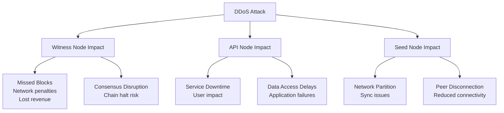
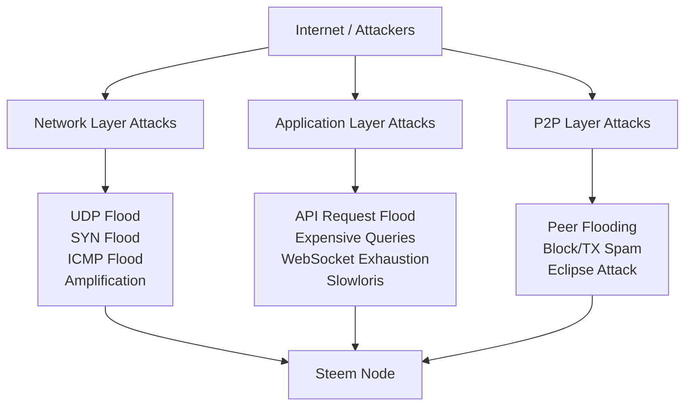
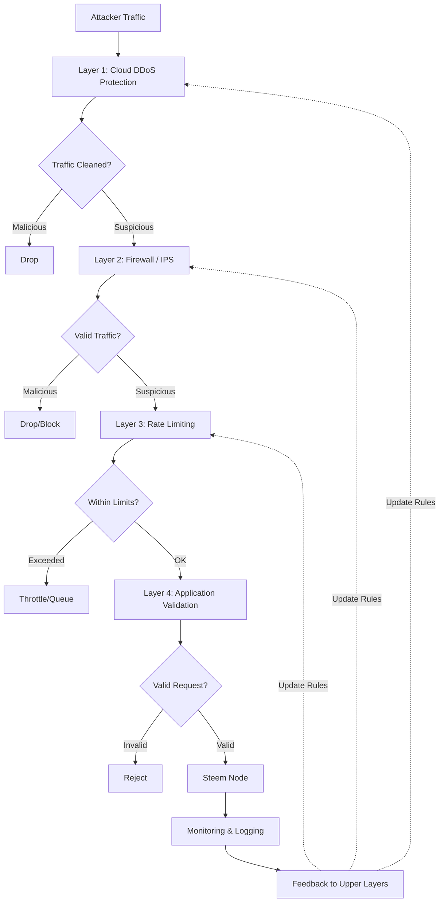
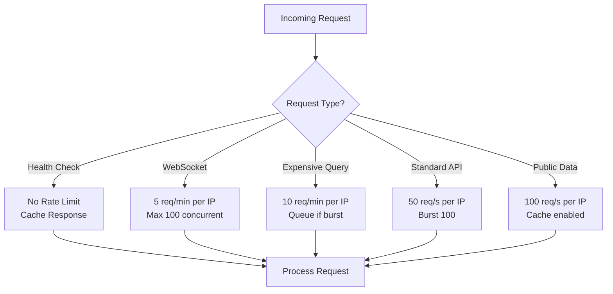
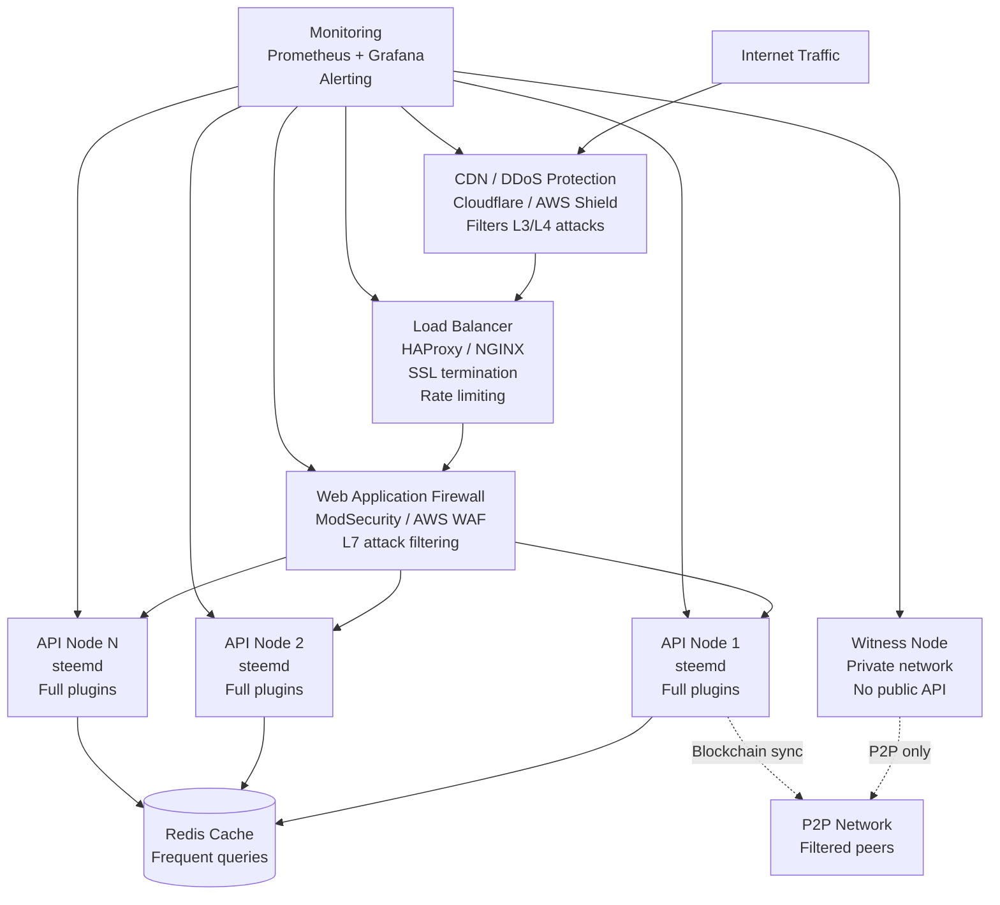
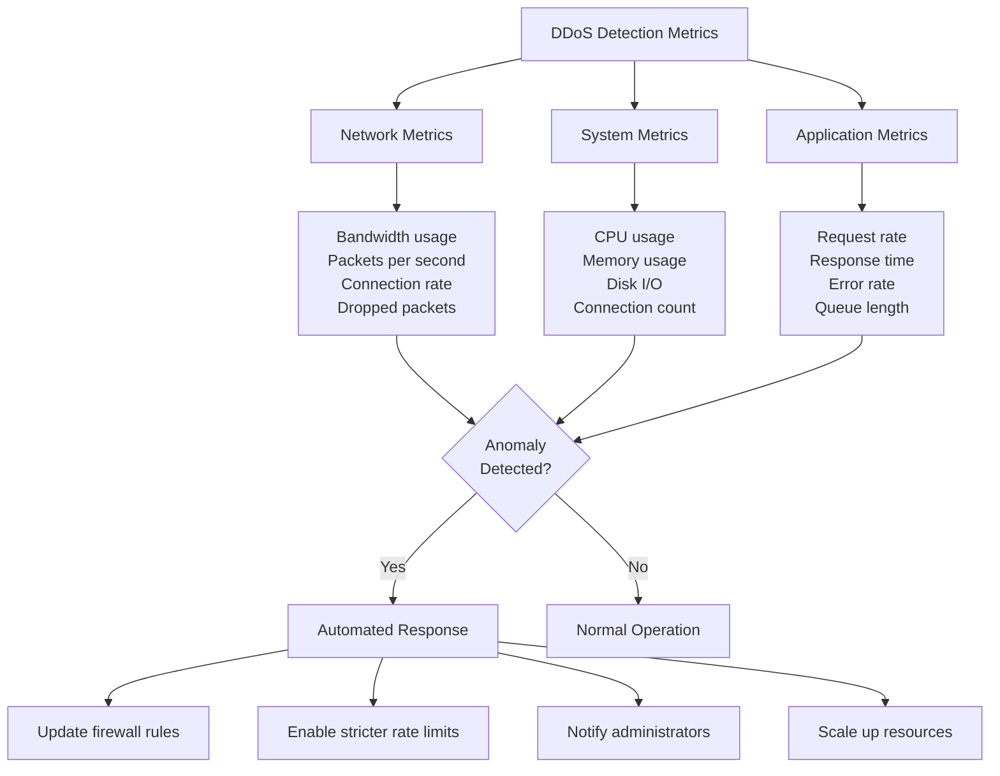
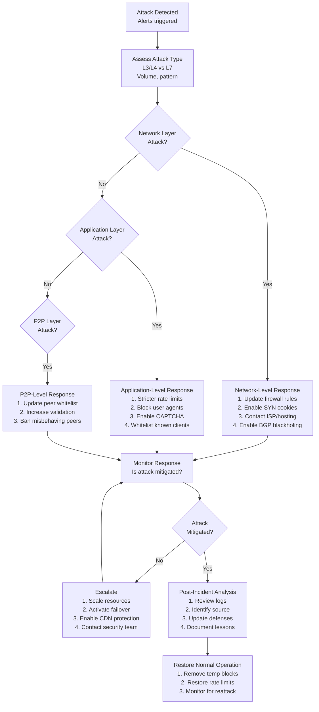

# DDoS Protection Guidelines for Steem Nodes

This document provides comprehensive guidelines for protecting Steem blockchain nodes from Distributed Denial of Service (DDoS) attacks.

## Table of Contents

1. [Overview](#overview)
2. [Attack Vectors](#attack-vectors)
3. [Defense Strategy](#defense-strategy)
4. [Network Layer Protection](#network-layer-protection)
5. [Application Layer Protection](#application-layer-protection)
6. [Rate Limiting](#rate-limiting)
7. [Infrastructure Setup](#infrastructure-setup)
8. [Monitoring and Detection](#monitoring-and-detection)
9. [Incident Response](#incident-response)
10. [Best Practices by Node Type](#best-practices-by-node-type)

## Overview

Steem nodes are susceptible to various types of DDoS attacks that can disrupt blockchain operations, API services, and network connectivity. A multi-layered defense strategy is essential to maintain service availability and protect critical infrastructure.

### Attack Impact by Node Type



## Attack Vectors

### 1. Network Layer Attacks (L3/L4)

#### UDP Flood
- **Target:** P2P port (2001), API ports
- **Method:** High-volume UDP packets overwhelming bandwidth
- **Impact:** Network saturation, legitimate traffic dropped

#### SYN Flood
- **Target:** TCP ports (2001, 8090, 8091)
- **Method:** Half-open TCP connections exhausting connection table
- **Impact:** New connections refused, service unavailable

#### ICMP Flood
- **Target:** Node IP address
- **Method:** Ping flood consuming bandwidth and CPU
- **Impact:** Network congestion, increased latency

#### Amplification Attacks
- **Target:** Node IP via reflection
- **Method:** DNS, NTP, SSDP amplification
- **Impact:** Massive bandwidth consumption

### 2. Application Layer Attacks (L7)

#### API Request Flood
- **Target:** RPC endpoints (8090, 8091)
- **Method:** High rate of valid-looking API requests
- **Impact:** CPU/memory exhaustion, slow responses

#### Expensive Query Attacks
- **Target:** database_api
- **Method:** Computationally expensive queries (large history ranges, deep blockchain queries)
- **Impact:** Database locks, slow response times, memory exhaustion

#### WebSocket Connection Exhaustion
- **Target:** WebSocket endpoint (8090)
- **Method:** Opening many connections without closing
- **Impact:** Connection limit reached, legitimate users blocked

#### Slowloris Attack
- **Target:** HTTP endpoints
- **Method:** Slow, partial HTTP requests keeping connections open
- **Impact:** Thread pool exhaustion, service unavailable

### 3. P2P Layer Attacks

#### Peer Flooding
- **Target:** P2P network (2001)
- **Method:** Many fake peer connections
- **Impact:** Connection slots exhausted, legitimate peers rejected

#### Block/Transaction Spam
- **Target:** P2P network
- **Method:** Broadcasting invalid or spam transactions/blocks
- **Impact:** CPU overhead validating garbage data, bandwidth waste

#### Eclipse Attack
- **Target:** Network topology
- **Method:** Surrounding node with attacker-controlled peers
- **Impact:** Network partition, consensus manipulation

### Attack Surface Map



## Defense Strategy

### Multi-Layer Defense Architecture



### Defense Layers

1. **Layer 1 - Cloud DDoS Protection:** Cloudflare, AWS Shield, Akamai
2. **Layer 2 - Network Firewall:** iptables, nftables, cloud firewall
3. **Layer 3 - Rate Limiting:** NGINX, HAProxy, application-level limits
4. **Layer 4 - Application Logic:** steemd built-in protections, plugin settings
5. **Layer 5 - Monitoring:** Real-time detection and automated response

## Network Layer Protection

### 1. Cloud-Based DDoS Protection

#### Cloudflare (Recommended for API Nodes)

**Features:**
- Automatic DDoS mitigation (up to hundreds of Gbps)
- Rate limiting and bot detection
- Global CDN for distributed protection
- SSL/TLS termination

**Configuration:**

```nginx
# Cloudflare-compatible NGINX config
server {
    listen 443 ssl http2;
    server_name api.example.com;

    ssl_certificate /etc/ssl/certs/example.com.crt;
    ssl_certificate_key /etc/ssl/private/example.com.key;

    # Trust Cloudflare IPs only
    set_real_ip_from 103.21.244.0/22;
    set_real_ip_from 103.22.200.0/22;
    set_real_ip_from 103.31.4.0/22;
    set_real_ip_from 104.16.0.0/13;
    set_real_ip_from 104.24.0.0/14;
    set_real_ip_from 108.162.192.0/18;
    set_real_ip_from 131.0.72.0/22;
    set_real_ip_from 141.101.64.0/18;
    set_real_ip_from 162.158.0.0/15;
    set_real_ip_from 172.64.0.0/13;
    set_real_ip_from 173.245.48.0/20;
    set_real_ip_from 188.114.96.0/20;
    set_real_ip_from 190.93.240.0/20;
    set_real_ip_from 197.234.240.0/22;
    set_real_ip_from 198.41.128.0/17;
    set_real_ip_from 2400:cb00::/32;
    set_real_ip_from 2606:4700::/32;
    set_real_ip_from 2803:f800::/32;
    set_real_ip_from 2405:b500::/32;
    set_real_ip_from 2405:8100::/32;
    set_real_ip_from 2c0f:f248::/32;
    set_real_ip_from 2a06:98c0::/29;

    real_ip_header CF-Connecting-IP;

    location / {
        proxy_pass http://localhost:8091;
        proxy_set_header Host $host;
        proxy_set_header X-Real-IP $remote_addr;
        proxy_set_header X-Forwarded-For $proxy_add_x_forwarded_for;
    }
}
```

**Cloudflare Firewall Rules:**

```javascript
// Block known bad User-Agents
(http.user_agent contains "scanner") or
(http.user_agent contains "crawler" and not http.user_agent contains "Googlebot")

// Rate limit per IP
(ip.src eq $ip and http.request.uri.path contains "/api")

// Challenge suspicious traffic
(cf.threat_score gt 10)

// Block by country (optional)
(ip.geoip.country in {"XX" "YY"})
```

#### AWS Shield + CloudFront

```yaml
# AWS CloudFormation example
AWSTemplateFormatVersion: '2010-09-09'
Resources:
  CloudFrontDistribution:
    Type: AWS::CloudFront::Distribution
    Properties:
      DistributionConfig:
        Enabled: true
        Origins:
          - Id: SteemAPI
            DomainName: steem-api.example.com
            CustomOriginConfig:
              HTTPPort: 80
              HTTPSPort: 443
              OriginProtocolPolicy: https-only
        DefaultCacheBehavior:
          TargetOriginId: SteemAPI
          ViewerProtocolPolicy: redirect-to-https
          AllowedMethods: [GET, HEAD, OPTIONS, PUT, POST, PATCH, DELETE]
          ForwardedValues:
            QueryString: true
            Headers:
              - Authorization
              - Content-Type
        WebACLId: !GetAtt WebACL.Arn

  WebACL:
    Type: AWS::WAFv2::WebACL
    Properties:
      Scope: CLOUDFRONT
      DefaultAction:
        Allow: {}
      Rules:
        - Name: RateLimitRule
          Priority: 1
          Statement:
            RateBasedStatement:
              Limit: 2000
              AggregateKeyType: IP
          Action:
            Block: {}
          VisibilityConfig:
            SampledRequestsEnabled: true
            CloudWatchMetricsEnabled: true
            MetricName: RateLimitRule
```

### 2. Firewall Configuration (iptables/nftables)

#### iptables Rules for Steem Node

```bash
#!/bin/bash
# DDoS protection rules for Steem node

# Flush existing rules
iptables -F
iptables -X
iptables -Z

# Default policies
iptables -P INPUT DROP
iptables -P FORWARD DROP
iptables -P OUTPUT ACCEPT

# Allow loopback
iptables -A INPUT -i lo -j ACCEPT

# Allow established connections
iptables -A INPUT -m conntrack --ctstate ESTABLISHED,RELATED -j ACCEPT

# Drop invalid packets
iptables -A INPUT -m conntrack --ctstate INVALID -j DROP

# Protection against SYN flood
iptables -A INPUT -p tcp --syn -m limit --limit 10/s --limit-burst 20 -j ACCEPT
iptables -A INPUT -p tcp --syn -j DROP

# Protection against port scanning
iptables -A INPUT -p tcp --tcp-flags ALL NONE -j DROP
iptables -A INPUT -p tcp --tcp-flags ALL ALL -j DROP
iptables -A INPUT -p tcp --tcp-flags SYN,FIN SYN,FIN -j DROP
iptables -A INPUT -p tcp --tcp-flags SYN,RST SYN,RST -j DROP

# Limit ICMP (ping) rate
iptables -A INPUT -p icmp --icmp-type echo-request -m limit --limit 1/s -j ACCEPT
iptables -A INPUT -p icmp --icmp-type echo-request -j DROP

# Rate limit P2P connections (port 2001)
iptables -A INPUT -p tcp --dport 2001 -m conntrack --ctstate NEW -m recent --set
iptables -A INPUT -p tcp --dport 2001 -m conntrack --ctstate NEW -m recent --update --seconds 60 --hitcount 10 -j DROP
iptables -A INPUT -p tcp --dport 2001 -j ACCEPT

# Rate limit WebSocket connections (port 8090)
iptables -A INPUT -p tcp --dport 8090 -m conntrack --ctstate NEW -m recent --set --name WS
iptables -A INPUT -p tcp --dport 8090 -m conntrack --ctstate NEW -m recent --update --seconds 60 --hitcount 30 --name WS -j DROP
iptables -A INPUT -p tcp --dport 8090 -j ACCEPT

# Rate limit HTTP API (port 8091)
iptables -A INPUT -p tcp --dport 8091 -m conntrack --ctstate NEW -m recent --set --name HTTP
iptables -A INPUT -p tcp --dport 8091 -m conntrack --ctstate NEW -m recent --update --seconds 60 --hitcount 50 --name HTTP -j DROP
iptables -A INPUT -p tcp --dport 8091 -j ACCEPT

# Allow SSH (change port as needed)
iptables -A INPUT -p tcp --dport 22 -m conntrack --ctstate NEW -m recent --set --name SSH
iptables -A INPUT -p tcp --dport 22 -m conntrack --ctstate NEW -m recent --update --seconds 60 --hitcount 4 -j DROP
iptables -A INPUT -p tcp --dport 22 -j ACCEPT

# Connection limit per IP
iptables -A INPUT -p tcp --syn -m connlimit --connlimit-above 50 --connlimit-mask 32 -j REJECT --reject-with tcp-reset

# Drop UDP floods (if not using UDP)
iptables -A INPUT -p udp -m limit --limit 10/s -j ACCEPT
iptables -A INPUT -p udp -j DROP

# Log dropped packets (for analysis)
iptables -A INPUT -m limit --limit 5/min -j LOG --log-prefix "iptables-dropped: " --log-level 7

# Save rules
iptables-save > /etc/iptables/rules.v4
```

#### nftables Configuration (Modern Alternative)

```bash
#!/usr/sbin/nft -f

flush ruleset

table inet filter {
    # Rate limit tracking sets
    set ratelimit_p2p {
        type ipv4_addr
        flags dynamic, timeout
        timeout 60s
    }

    set ratelimit_api {
        type ipv4_addr
        flags dynamic, timeout
        timeout 60s
    }

    set blacklist {
        type ipv4_addr
        flags timeout
        timeout 1h
    }

    chain input {
        type filter hook input priority 0; policy drop;

        # Accept loopback
        iif lo accept

        # Accept established connections
        ct state established,related accept
        ct state invalid drop

        # Drop blacklisted IPs
        ip saddr @blacklist drop

        # SYN flood protection
        tcp flags syn tcp option maxseg size 1-536 drop
        tcp flags & (fin|syn|rst|ack) == syn ct state new limit rate 10/second burst 20 packets accept
        tcp flags & (fin|syn|rst|ack) == syn ct state new drop

        # ICMP rate limiting
        icmp type echo-request limit rate 1/second accept
        icmp type echo-request drop

        # P2P port protection (2001)
        tcp dport 2001 ct state new add @ratelimit_p2p { ip saddr limit rate 10/minute } accept
        tcp dport 2001 drop

        # WebSocket rate limiting (8090)
        tcp dport 8090 ct state new add @ratelimit_api { ip saddr limit rate 30/minute } accept
        tcp dport 8090 ct state new drop
        tcp dport 8090 accept

        # HTTP API rate limiting (8091)
        tcp dport 8091 ct state new add @ratelimit_api { ip saddr limit rate 50/minute } accept
        tcp dport 8091 ct state new drop
        tcp dport 8091 accept

        # SSH with rate limiting
        tcp dport 22 ct state new limit rate 4/minute accept
        tcp dport 22 drop

        # Log and drop
        limit rate 5/minute log prefix "nft-dropped: "
    }

    chain forward {
        type filter hook forward priority 0; policy drop;
    }

    chain output {
        type filter hook output priority 0; policy accept;
    }
}
```

### 3. Connection Limits (sysctl)

```bash
# /etc/sysctl.d/99-ddos-protection.conf

# IP forwarding (disable if not routing)
net.ipv4.ip_forward = 0

# SYN cookies (protection against SYN flood)
net.ipv4.tcp_syncookies = 1
net.ipv4.tcp_syn_retries = 2
net.ipv4.tcp_synack_retries = 2
net.ipv4.tcp_max_syn_backlog = 4096

# Increase connection tracking table size
net.netfilter.nf_conntrack_max = 1000000
net.netfilter.nf_conntrack_tcp_timeout_established = 600

# Protect against time-wait assassination
net.ipv4.tcp_rfc1337 = 1

# Reduce TIME_WAIT connections
net.ipv4.tcp_fin_timeout = 15
net.ipv4.tcp_tw_reuse = 1

# Increase local port range
net.ipv4.ip_local_port_range = 10000 65535

# Disable ICMP redirects
net.ipv4.conf.all.accept_redirects = 0
net.ipv4.conf.default.accept_redirects = 0
net.ipv4.conf.all.send_redirects = 0
net.ipv4.conf.default.send_redirects = 0

# Disable source packet routing
net.ipv4.conf.all.accept_source_route = 0
net.ipv4.conf.default.accept_source_route = 0

# Enable bad error message protection
net.ipv4.icmp_ignore_bogus_error_responses = 1

# Enable reverse path filtering (anti-spoofing)
net.ipv4.conf.all.rp_filter = 1
net.ipv4.conf.default.rp_filter = 1

# Log martian packets
net.ipv4.conf.all.log_martians = 1
net.ipv4.conf.default.log_martians = 1

# Increase network buffer sizes
net.core.rmem_max = 134217728
net.core.wmem_max = 134217728
net.ipv4.tcp_rmem = 4096 87380 67108864
net.ipv4.tcp_wmem = 4096 65536 67108864

# Enable TCP Fast Open
net.ipv4.tcp_fastopen = 3

# Apply settings
# Run: sysctl -p /etc/sysctl.d/99-ddos-protection.conf
```

## Application Layer Protection

### 1. NGINX Reverse Proxy Configuration

```nginx
# /etc/nginx/nginx.conf

user nginx;
worker_processes auto;
worker_rlimit_nofile 100000;

events {
    worker_connections 4096;
    use epoll;
    multi_accept on;
}

http {
    include /etc/nginx/mime.types;
    default_type application/json;

    # Logging
    log_format main '$remote_addr - $remote_user [$time_local] "$request" '
                    '$status $body_bytes_sent "$http_referer" '
                    '"$http_user_agent" "$http_x_forwarded_for" '
                    'rt=$request_time uct="$upstream_connect_time" '
                    'uht="$upstream_header_time" urt="$upstream_response_time"';

    access_log /var/log/nginx/access.log main buffer=32k flush=5s;
    error_log /var/log/nginx/error.log warn;

    # Performance tuning
    sendfile on;
    tcp_nopush on;
    tcp_nodelay on;
    keepalive_timeout 65;
    keepalive_requests 100;
    reset_timedout_connection on;
    client_body_timeout 10;
    send_timeout 10;

    # Buffer sizes
    client_header_buffer_size 1k;
    client_body_buffer_size 16k;
    large_client_header_buffers 4 8k;
    client_max_body_size 1m;

    # Compression
    gzip on;
    gzip_vary on;
    gzip_proxied any;
    gzip_comp_level 6;
    gzip_types application/json application/javascript text/css text/plain;

    # Rate limiting zones
    limit_req_zone $binary_remote_addr zone=api_global:10m rate=50r/s;
    limit_req_zone $binary_remote_addr zone=api_strict:10m rate=10r/s;
    limit_req_zone $binary_remote_addr zone=ws_conn:10m rate=5r/s;
    limit_conn_zone $binary_remote_addr zone=conn_limit:10m;

    # Cache for static responses (health checks)
    proxy_cache_path /var/cache/nginx levels=1:2 keys_zone=api_cache:10m max_size=100m inactive=60m;

    # Upstream steemd
    upstream steemd_api {
        least_conn;
        server 127.0.0.1:8091 max_fails=3 fail_timeout=30s;
        # Add more backend servers for load balancing
        # server 127.0.0.1:8092 max_fails=3 fail_timeout=30s;
        keepalive 32;
    }

    upstream steemd_ws {
        least_conn;
        server 127.0.0.1:8090 max_fails=3 fail_timeout=30s;
        keepalive 32;
    }

    # Block bad bots
    map $http_user_agent $bad_bot {
        default 0;
        ~*^$ 1;  # Empty user agent
        ~*(bot|crawler|spider|scraper|scanner) 1;
        ~*(wget|curl|python-requests) 1;  # Adjust based on your needs
    }

    # Rate limit by request pattern
    map $request_uri $rate_limit_key {
        default $binary_remote_addr;
        ~*/health "" ;  # Don't rate limit health checks
    }

    server {
        listen 80;
        server_name _;
        return 301 https://$host$request_uri;
    }

    server {
        listen 443 ssl http2;
        server_name api.example.com;

        # SSL configuration
        ssl_certificate /etc/ssl/certs/api.example.com.crt;
        ssl_certificate_key /etc/ssl/private/api.example.com.key;
        ssl_protocols TLSv1.2 TLSv1.3;
        ssl_ciphers HIGH:!aNULL:!MD5;
        ssl_prefer_server_ciphers on;
        ssl_session_cache shared:SSL:10m;
        ssl_session_timeout 10m;

        # Security headers
        add_header Strict-Transport-Security "max-age=31536000; includeSubDomains" always;
        add_header X-Content-Type-Options "nosniff" always;
        add_header X-Frame-Options "DENY" always;
        add_header X-XSS-Protection "1; mode=block" always;

        # Block bad bots
        if ($bad_bot) {
            return 403;
        }

        # Connection limit
        limit_conn conn_limit 10;

        # Health check endpoint (no rate limit)
        location /health {
            access_log off;
            proxy_cache api_cache;
            proxy_cache_valid 200 10s;
            add_header Content-Type text/plain;
            return 200 "OK\n";
        }

        # WebSocket endpoint
        location /ws {
            limit_req zone=ws_conn burst=10 nodelay;

            proxy_pass http://steemd_ws;
            proxy_http_version 1.1;
            proxy_set_header Upgrade $http_upgrade;
            proxy_set_header Connection "upgrade";
            proxy_set_header Host $host;
            proxy_set_header X-Real-IP $remote_addr;
            proxy_set_header X-Forwarded-For $proxy_add_x_forwarded_for;
            proxy_read_timeout 3600s;
            proxy_send_timeout 3600s;
        }

        # API endpoints with strict rate limiting
        location ~* /(get_account_history|get_block|get_ops_in_block) {
            limit_req zone=api_strict burst=20 nodelay;
            limit_req_status 429;

            proxy_pass http://steemd_api;
            proxy_http_version 1.1;
            proxy_set_header Connection "";
            proxy_set_header Host $host;
            proxy_set_header X-Real-IP $remote_addr;
            proxy_set_header X-Forwarded-For $proxy_add_x_forwarded_for;
            proxy_connect_timeout 5s;
            proxy_send_timeout 10s;
            proxy_read_timeout 10s;
        }

        # General API endpoint
        location / {
            limit_req zone=api_global burst=100 nodelay;
            limit_req_status 429;

            proxy_pass http://steemd_api;
            proxy_http_version 1.1;
            proxy_set_header Connection "";
            proxy_set_header Host $host;
            proxy_set_header X-Real-IP $remote_addr;
            proxy_set_header X-Forwarded-For $proxy_add_x_forwarded_for;
            proxy_connect_timeout 5s;
            proxy_send_timeout 10s;
            proxy_read_timeout 30s;
        }
    }
}
```

### 2. HAProxy Configuration (Alternative)

```haproxy
# /etc/haproxy/haproxy.cfg

global
    log /dev/log local0
    log /dev/log local1 notice
    chroot /var/lib/haproxy
    stats socket /run/haproxy/admin.sock mode 660 level admin
    stats timeout 30s
    user haproxy
    group haproxy
    daemon

    # DDoS protection settings
    maxconn 50000
    tune.ssl.default-dh-param 2048

defaults
    log global
    mode http
    option httplog
    option dontlognull
    option http-server-close
    option forwardfor except 127.0.0.0/8
    option redispatch
    retries 3
    timeout connect 5s
    timeout client 30s
    timeout server 30s
    timeout http-request 10s
    timeout http-keep-alive 10s
    errorfile 400 /etc/haproxy/errors/400.http
    errorfile 403 /etc/haproxy/errors/403.http
    errorfile 408 /etc/haproxy/errors/408.http
    errorfile 500 /etc/haproxy/errors/500.http
    errorfile 502 /etc/haproxy/errors/502.http
    errorfile 503 /etc/haproxy/errors/503.http
    errorfile 504 /etc/haproxy/errors/504.http

# Stats page
listen stats
    bind *:8404
    stats enable
    stats uri /stats
    stats refresh 30s
    stats auth admin:your-secure-password

# Rate limiting stick tables
backend ratelimit_table
    stick-table type ip size 1m expire 10s store http_req_rate(10s)

# Frontend for API
frontend api_frontend
    bind *:443 ssl crt /etc/ssl/certs/api.example.com.pem
    bind *:80
    redirect scheme https if !{ ssl_fc }

    # DDoS protection
    tcp-request connection reject if { src_conn_rate(Abuse) ge 10 }
    tcp-request connection track-sc0 src table Abuse

    # Rate limiting
    stick-table type ip size 1m expire 10s store http_req_rate(10s)
    http-request track-sc0 src
    http-request deny deny_status 429 if { sc_http_req_rate(0) gt 100 }

    # Security headers
    http-response set-header Strict-Transport-Security "max-age=31536000; includeSubDomains"
    http-response set-header X-Content-Type-Options "nosniff"
    http-response set-header X-Frame-Options "DENY"

    # ACLs
    acl is_websocket hdr(Upgrade) -i WebSocket
    acl is_health_check path /health

    # Routing
    use_backend health_backend if is_health_check
    use_backend websocket_backend if is_websocket
    default_backend api_backend

# Abuse tracking
backend Abuse
    stick-table type ip size 1m expire 60s store conn_rate(10s)

# Health check backend
backend health_backend
    http-request return status 200 content-type text/plain string "OK\n"

# WebSocket backend
backend websocket_backend
    balance leastconn
    option http-server-close
    timeout server 3600s
    server ws1 127.0.0.1:8090 check maxconn 1000

# API backend
backend api_backend
    balance leastconn
    option httpchk GET /health
    timeout server 30s
    server api1 127.0.0.1:8091 check maxconn 5000
    # Add more servers for scaling
    # server api2 127.0.0.1:8092 check maxconn 5000
```

## Rate Limiting

### Strategy by Endpoint Type



### Application-Level Rate Limiting (steemd config)

```ini
# config.ini

# WebSocket settings
webserver-ws-endpoint = 127.0.0.1:8090
webserver-thread-pool-size = 32

# HTTP RPC settings
webserver-http-endpoint = 127.0.0.1:8091

# Connection limits
p2p-max-connections = 100

# API call limits (implement via proxy, not native to steemd)
# Use NGINX/HAProxy for actual rate limiting
```

### Redis-Based Rate Limiting (for distributed systems)

```python
#!/usr/bin/env python3
# Rate limiting middleware using Redis

import redis
import time
from functools import wraps

redis_client = redis.Redis(host='localhost', port=6379, db=0)

def rate_limit(max_requests, window_seconds, key_prefix='ratelimit'):
    """
    Rate limiting decorator using sliding window algorithm

    Args:
        max_requests: Maximum requests allowed in the time window
        window_seconds: Time window in seconds
        key_prefix: Redis key prefix
    """
    def decorator(func):
        @wraps(func)
        def wrapper(*args, **kwargs):
            # Get client IP (adjust based on your framework)
            client_ip = kwargs.get('client_ip', 'unknown')

            # Create Redis key
            key = f"{key_prefix}:{func.__name__}:{client_ip}"

            # Get current timestamp
            now = time.time()

            # Remove old entries outside the window
            redis_client.zremrangebyscore(key, 0, now - window_seconds)

            # Count requests in current window
            request_count = redis_client.zcard(key)

            if request_count >= max_requests:
                # Rate limit exceeded
                raise Exception(f"Rate limit exceeded: {max_requests}/{window_seconds}s")

            # Add current request
            redis_client.zadd(key, {now: now})
            redis_client.expire(key, window_seconds)

            return func(*args, **kwargs)

        return wrapper
    return decorator

# Usage example
@rate_limit(max_requests=10, window_seconds=60)
def expensive_api_call(client_ip):
    # Process API call
    pass
```

## Infrastructure Setup

### Production Architecture with DDoS Protection



### Deployment Checklist

#### Witness Node Protection
- [ ] No public API endpoints (disable webserver plugin)
- [ ] P2P port (2001) with strict IP whitelist
- [ ] Separate network segment / private IP
- [ ] Firewall rules allowing only known peers
- [ ] DDoS protection at network layer only
- [ ] Failover witness node ready
- [ ] Monitoring for missed blocks

#### API Node Protection
- [ ] Behind CDN/DDoS protection service
- [ ] NGINX/HAProxy reverse proxy with rate limiting
- [ ] WAF rules configured
- [ ] Rate limits per endpoint type
- [ ] Connection limits enforced
- [ ] Cache layer for common queries
- [ ] Health check endpoints
- [ ] Auto-scaling configured
- [ ] Log aggregation and analysis

#### Seed Node Protection
- [ ] High bandwidth connection
- [ ] P2P connection limits
- [ ] Peer reputation system
- [ ] Invalid transaction filtering
- [ ] Geographic distribution
- [ ] Monitoring for peer behavior

## Monitoring and Detection

### Key Metrics to Monitor



### Prometheus Monitoring Configuration

```yaml
# prometheus.yml

global:
  scrape_interval: 15s
  evaluation_interval: 15s

rule_files:
  - 'ddos_alerts.yml'

scrape_configs:
  # Node exporter (system metrics)
  - job_name: 'node'
    static_configs:
      - targets: ['localhost:9100']

  # NGINX metrics
  - job_name: 'nginx'
    static_configs:
      - targets: ['localhost:9113']

  # Custom steemd metrics (if exposed)
  - job_name: 'steemd'
    static_configs:
      - targets: ['localhost:8091']
    metrics_path: '/metrics'
```

### Alert Rules

```yaml
# ddos_alerts.yml

groups:
  - name: ddos_detection
    interval: 30s
    rules:
      # High request rate
      - alert: HighRequestRate
        expr: rate(nginx_http_requests_total[1m]) > 1000
        for: 2m
        labels:
          severity: warning
        annotations:
          summary: "High request rate detected"
          description: "Request rate is {{ $value }} req/s"

      # High error rate
      - alert: HighErrorRate
        expr: rate(nginx_http_requests_total{status=~"5.."}[5m]) > 10
        for: 1m
        labels:
          severity: critical
        annotations:
          summary: "High error rate detected"
          description: "Error rate is {{ $value }} errors/s"

      # Connection exhaustion
      - alert: ConnectionExhaustion
        expr: node_netstat_Tcp_CurrEstab > 10000
        for: 2m
        labels:
          severity: warning
        annotations:
          summary: "High number of TCP connections"
          description: "Current connections: {{ $value }}"

      # Bandwidth saturation
      - alert: BandwidthSaturation
        expr: rate(node_network_receive_bytes_total[1m]) > 100000000
        for: 5m
        labels:
          severity: warning
        annotations:
          summary: "High network receive rate"
          description: "Receive rate: {{ $value }} bytes/s"

      # CPU overload
      - alert: CPUOverload
        expr: 100 - (avg by (instance) (irate(node_cpu_seconds_total{mode="idle"}[5m])) * 100) > 90
        for: 5m
        labels:
          severity: warning
        annotations:
          summary: "High CPU usage"
          description: "CPU usage is {{ $value }}%"

      # Memory pressure
      - alert: MemoryPressure
        expr: (node_memory_MemTotal_bytes - node_memory_MemAvailable_bytes) / node_memory_MemTotal_bytes * 100 > 90
        for: 5m
        labels:
          severity: warning
        annotations:
          summary: "High memory usage"
          description: "Memory usage is {{ $value }}%"

      # P2P connection flooding
      - alert: P2PConnectionFlood
        expr: increase(node_netstat_Tcp_PassiveOpens[1m]) > 100
        for: 2m
        labels:
          severity: warning
        annotations:
          summary: "High rate of incoming TCP connections"
          description: "New connections per minute: {{ $value }}"
```

### Log Analysis with fail2ban

```ini
# /etc/fail2ban/jail.local

[DEFAULT]
bantime = 3600
findtime = 600
maxretry = 5
backend = systemd

[nginx-req-limit]
enabled = true
filter = nginx-req-limit
logpath = /var/log/nginx/error.log
maxretry = 10
findtime = 60
bantime = 3600

[nginx-conn-limit]
enabled = true
filter = nginx-conn-limit
logpath = /var/log/nginx/error.log
maxretry = 5
findtime = 60
bantime = 7200

[steemd-api-abuse]
enabled = true
filter = steemd-api-abuse
logpath = /var/log/nginx/access.log
maxretry = 100
findtime = 60
bantime = 1800
```

```conf
# /etc/fail2ban/filter.d/nginx-req-limit.conf

[Definition]
failregex = limiting requests, excess:.* by zone.*client: <HOST>
ignoreregex =
```

```conf
# /etc/fail2ban/filter.d/nginx-conn-limit.conf

[Definition]
failregex = limiting connections by zone.*client: <HOST>
ignoreregex =
```

```conf
# /etc/fail2ban/filter.d/steemd-api-abuse.conf

[Definition]
failregex = ^<HOST> -.*"(GET|POST) /(get_account_history|get_block|get_ops_in_block).*" (200|429)
ignoreregex =
```

## Incident Response

### DDoS Attack Response Workflow



### Response Playbook

#### Phase 1: Detection (0-5 minutes)
1. **Confirm attack is occurring**
   - Check monitoring dashboards
   - Review alert patterns
   - Correlate metrics (traffic, CPU, errors)

2. **Classify attack type**
   - Network layer (bandwidth, SYN flood, UDP flood)
   - Application layer (API abuse, expensive queries)
   - P2P layer (peer flooding, transaction spam)

3. **Assess impact**
   - Service availability
   - Affected components
   - User impact severity

#### Phase 2: Immediate Response (5-15 minutes)

**For Network Layer Attacks:**
```bash
# Enable aggressive SYN cookie protection
sysctl -w net.ipv4.tcp_syncookies=1

# Reduce SYN retries
sysctl -w net.ipv4.tcp_syn_retries=1
sysctl -w net.ipv4.tcp_synack_retries=1

# Increase SYN backlog
sysctl -w net.ipv4.tcp_max_syn_backlog=8192

# Block top attacking IPs (get from logs)
iptables -A INPUT -s ATTACKER_IP -j DROP

# Enable connection tracking
iptables -A INPUT -m conntrack --ctstate NEW -m recent --set
iptables -A INPUT -m conntrack --ctstate NEW -m recent --update --seconds 60 --hitcount 5 -j DROP
```

**For Application Layer Attacks:**
```bash
# Update NGINX rate limits (reduce limits temporarily)
# Edit /etc/nginx/nginx.conf
limit_req_zone $binary_remote_addr zone=api_global:10m rate=10r/s;

# Reload NGINX
nginx -t && systemctl reload nginx

# Enable stricter fail2ban
fail2ban-client set nginx-req-limit maxretry 5
fail2ban-client set nginx-req-limit bantime 7200
```

**For P2P Layer Attacks:**
```ini
# Update steemd config.ini
p2p-max-connections = 50  # Reduce from default

# Add trusted peer whitelist only
seed-node = trusted-peer1.example.com:2001
seed-node = trusted-peer2.example.com:2001

# Restart steemd (carefully, may cause downtime)
systemctl restart steemd
```

#### Phase 3: Sustained Defense (15-60 minutes)

1. **Activate additional protection layers**
   - Enable Cloudflare "I'm Under Attack" mode
   - Activate AWS Shield Advanced (if available)
   - Enable BGP blackholing for large attacks

2. **Scale resources if needed**
   - Add more API node instances
   - Increase instance sizes
   - Enable auto-scaling rules

3. **Implement temporary restrictions**
   - Require authentication for API access
   - Enable CAPTCHA for web interfaces
   - Whitelist known good clients

4. **Communicate status**
   - Update status page
   - Notify users of degraded performance
   - Alert team members

#### Phase 4: Analysis and Recovery (1+ hours)

1. **Collect forensic data**
```bash
# Capture traffic sample
tcpdump -i eth0 -s 65535 -w /tmp/attack-$(date +%s).pcap

# Export connection statistics
netstat -ntu | awk '{print $5}' | cut -d: -f1 | sort | uniq -c | sort -n > /tmp/attack-ips.txt

# Export firewall logs
iptables -L -n -v > /tmp/iptables-stats.txt

# Export NGINX logs
grep "$(date +%d/%b/%Y:%H)" /var/log/nginx/access.log > /tmp/nginx-attack.log
```

2. **Identify attack source**
   - Analyze IP patterns (botnets vs single source)
   - Check for geographic concentration
   - Identify attack signatures
   - Determine motivation (targeted vs collateral)

3. **Update permanent defenses**
   - Add attack signatures to WAF
   - Update firewall blacklists
   - Improve rate limiting rules
   - Add monitoring for similar patterns

4. **Document incident**
   - Timeline of events
   - Actions taken
   - Effectiveness of responses
   - Lessons learned
   - Recommendations for improvement

### Automated Response Scripts

```bash
#!/bin/bash
# /usr/local/bin/ddos-auto-response.sh
# Automated DDoS response script triggered by monitoring

ALERT_TYPE=$1  # high_traffic, high_error, connection_flood
SEVERITY=$2     # warning, critical

LOG_FILE="/var/log/ddos-response.log"

log_message() {
    echo "$(date '+%Y-%m-%d %H:%M:%S') - $1" | tee -a $LOG_FILE
}

log_message "DDoS response triggered: Type=$ALERT_TYPE, Severity=$SEVERITY"

case $ALERT_TYPE in
    high_traffic)
        log_message "Enabling stricter rate limits"

        # Update NGINX config
        sed -i 's/rate=50r\/s/rate=10r\/s/g' /etc/nginx/nginx.conf
        nginx -t && systemctl reload nginx

        # Send alert
        curl -X POST "https://hooks.slack.com/YOUR_WEBHOOK" \
            -d '{"text":"DDoS detected: High traffic. Rate limits reduced."}'
        ;;

    high_error)
        log_message "High error rate detected, analyzing logs"

        # Find top error-causing IPs
        tail -10000 /var/log/nginx/error.log | \
            grep -oP '(?<=client: )\d+\.\d+\.\d+\.\d+' | \
            sort | uniq -c | sort -rn | head -10 > /tmp/top-error-ips.txt

        # Block top offenders
        while read count ip; do
            if [ $count -gt 100 ]; then
                log_message "Blocking IP $ip (error count: $count)"
                iptables -A INPUT -s $ip -j DROP
            fi
        done < /tmp/top-error-ips.txt

        # Save iptables
        iptables-save > /etc/iptables/rules.v4
        ;;

    connection_flood)
        log_message "Connection flood detected"

        # Enable aggressive connection limits
        sysctl -w net.ipv4.tcp_syncookies=1
        sysctl -w net.ipv4.tcp_max_syn_backlog=8192

        # Find IPs with most connections
        netstat -ntu | awk '{print $5}' | cut -d: -f1 | \
            sort | uniq -c | sort -rn | head -10 > /tmp/top-conn-ips.txt

        # Block IPs with excessive connections
        while read count ip; do
            if [ $count -gt 50 ] && [ "$ip" != "127.0.0.1" ]; then
                log_message "Blocking IP $ip (connections: $count)"
                iptables -A INPUT -s $ip -j DROP
            fi
        done < /tmp/top-conn-ips.txt

        iptables-save > /etc/iptables/rules.v4
        ;;
esac

log_message "DDoS response completed"
```

## Best Practices by Node Type

### Witness Node

**Critical Protection (Block Production Must Continue)**

```ini
# config.ini - Witness configuration

# NO public API - only P2P
plugin = chain p2p witness

# P2P only on specific interface
p2p-endpoint = 10.0.0.10:2001  # Private IP only

# Trusted peers only
seed-node = peer1.trusted.com:2001
seed-node = peer2.trusted.com:2001

# Witness settings
witness = "your-witness-name"
private-key = YOUR_PRIVATE_KEY

# Resource limits
shared-file-size = 24G
```

**Firewall Rules:**
```bash
# Allow only specific peer IPs
iptables -A INPUT -p tcp --dport 2001 -s PEER1_IP -j ACCEPT
iptables -A INPUT -p tcp --dport 2001 -s PEER2_IP -j ACCEPT
iptables -A INPUT -p tcp --dport 2001 -j DROP

# Allow monitoring from specific IP
iptables -A INPUT -p tcp --dport 22 -s MONITOR_IP -j ACCEPT
iptables -A INPUT -p tcp --dport 22 -j DROP
```

**Monitoring Alerts:**
- Missed blocks (immediate alert)
- P2P disconnection (critical)
- CPU spike (warning)
- Memory pressure (warning)

### API Node

**Balanced Protection (Availability + Performance)**

```ini
# config.ini - API node configuration

# Full plugin set
plugin = chain p2p webserver
plugin = database_api block_api
plugin = account_history_rocksdb account_history_api
plugin = follow follow_api
plugin = market_history market_history_api
plugin = account_by_key_api

# Bind to localhost only (proxy handles external)
webserver-http-endpoint = 127.0.0.1:8091
webserver-ws-endpoint = 127.0.0.1:8090

# P2P on standard port
p2p-endpoint = 0.0.0.0:2001

# Resource configuration
shared-file-size = 80G
webserver-thread-pool-size = 32
```

**Protection Stack:**
1. Cloudflare / AWS Shield (external)
2. NGINX with rate limiting (reverse proxy)
3. Fail2ban (automated blocking)
4. Application-level validation

**Monitoring Alerts:**
- Request rate spike (warning)
- High response time (warning)
- Error rate increase (critical)
- Cache hit rate drop (warning)

### Seed Node

**Network Health Protection**

```ini
# config.ini - Seed node configuration

# Minimal plugins
plugin = chain p2p

# Accept many connections
p2p-endpoint = 0.0.0.0:2001
p2p-max-connections = 200

# Resource limits
shared-file-size = 24G
```

**Firewall Rules:**
```bash
# Rate limit P2P connections
iptables -A INPUT -p tcp --dport 2001 -m conntrack --ctstate NEW -m recent --set
iptables -A INPUT -p tcp --dport 2001 -m conntrack --ctstate NEW -m recent --update --seconds 60 --hitcount 20 -j DROP
iptables -A INPUT -p tcp --dport 2001 -j ACCEPT

# Limit total connections per IP
iptables -A INPUT -p tcp --dport 2001 -m connlimit --connlimit-above 5 --connlimit-mask 32 -j REJECT
```

**Monitoring Alerts:**
- Bandwidth saturation (warning)
- Peer churn rate (warning)
- Invalid message rate (warning)

## Conclusion

Effective DDoS protection for Steem nodes requires a multi-layered approach:

1. **Prevention:** Cloud DDoS protection, firewall rules, rate limiting
2. **Detection:** Real-time monitoring, anomaly detection, alerting
3. **Response:** Automated mitigation, manual intervention, incident playbooks
4. **Recovery:** Post-incident analysis, defense improvements, documentation

### Key Takeaways

- **Witness nodes** require the strictest protection (missed blocks = lost rewards)
- **API nodes** benefit most from cloud DDoS protection and rate limiting
- **Seed nodes** need bandwidth and connection management
- **Layered defense** is more effective than any single solution
- **Monitoring** is critical for early detection and response
- **Automation** reduces response time during attacks
- **Documentation** improves future response effectiveness

### Regular Maintenance

- [ ] Weekly: Review firewall logs and update blacklists
- [ ] Weekly: Test failover procedures
- [ ] Monthly: Review and update rate limits based on usage patterns
- [ ] Monthly: Update security patches and software
- [ ] Quarterly: Conduct DDoS simulation exercises
- [ ] Quarterly: Review and update incident response playbooks
- [ ] Annually: Audit entire security infrastructure

### Additional Resources

- [Cloudflare DDoS Protection](https://www.cloudflare.com/ddos/)
- [AWS Shield Documentation](https://aws.amazon.com/shield/)
- [NGINX Rate Limiting](https://www.nginx.com/blog/rate-limiting-nginx/)
- [iptables Tutorial](https://www.netfilter.org/documentation/)
- [Fail2ban Documentation](https://www.fail2ban.org/)

For Steem-specific guidance:
- [System Architecture](system-architecture.md) - Understanding node requirements
- [Building Guide](building.md) - Setting up Steem nodes
- [Exchange Quick Start](exchangequickstart.md) - Security for exchange nodes
