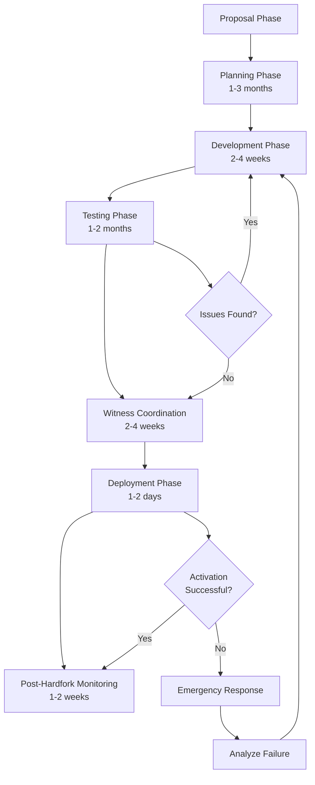

# Steem Blockchain Hardfork Procedure

This document describes the procedure for planning, implementing, testing, and deploying future hardforks on the Steem blockchain, operating under the Genesis HF 0 model.

## Table of Contents

1. [Overview](#overview)
2. [Genesis HF 0 Model](#genesis-hf-0-model)
3. [Planning Phase](#planning-phase)
4. [Development Phase](#development-phase)
5. [Testing Phase](#testing-phase)
6. [Witness Coordination](#witness-coordination)
7. [Deployment Phase](#deployment-phase)
8. [Post-Hardfork Monitoring](#post-hardfork-monitoring)
9. [Troubleshooting](#troubleshooting)

## Overview

A hardfork is a **backwards-incompatible protocol change** that requires all nodes on the network to upgrade to the new version. In Steem, hardforks are coordinated through a decentralized witness consensus mechanism.

### Key Principles

- **Consensus-driven**: At least 67% (17 out of 21) of active witnesses must upgrade
- **Time-based activation**: Hardforks activate at a specific timestamp, not block height
- **Backwards-incompatible**: Old nodes cannot process blocks after the hardfork
- **Extensively tested**: Multiple rounds of testnet validation before mainnet deployment

### Hardfork Lifecycle



## Genesis HF 0 Model

### Current Architecture

As of 2025, Steem operates under the **Genesis HF 0 model**, where:

- **All previous hardforks (HF 0_1 through 0_21) have been consolidated into Genesis (HF 0)**
- **No hardfork version branching** - all features are active from genesis
- **Simplified codebase** - no conditional hardfork checks in consensus code
- **Clean slate** - legacy migration code has been removed

### What This Means for Future Hardforks

Future hardforks (HF 0_1, 0_2, etc.) will be **true protocol upgrades** that:

1. **Add new features** without compatibility with old versions
2. **Require all nodes to upgrade** before activation
3. **Have no migration logic** from previous hardforks
4. **Start from a clean, unified protocol base**

### Hardfork Numbering

Starting from Genesis HF 0, future hardforks will use:

- `STEEM_HARDFORK_0_1` = First hardfork after Genesis
- `STEEM_HARDFORK_0_2` = Second hardfork after Genesis
- etc.

**Important**: These are NEW hardforks, not the historical HF 0_1-0_21 which are now part of Genesis.

## Planning Phase

### 1. Proposal and Community Discussion

**Duration:** 1-3 months

**Activities:**
- Identify problems or improvements needed
- Draft initial proposal document
- Present to community via blog posts and forums
- Gather feedback from witnesses, developers, and users
- Refine proposal based on community input

**Proposal Template:**

```markdown
## Hardfork N Proposal

### Overview
[Brief description of the hardfork]

### Motivation
[Why is this change needed?]

### Proposed Changes
1. [Change 1]
2. [Change 2]
3. [Change 3]

### Economic Impact
- Impact on rewards: [description]
- Impact on inflation: [description]
- Impact on token holders: [description]

### Technical Complexity
- Database changes: [Yes/No, describe]
- New operations: [List]
- API changes: [List]
- Breaking changes: [List]

### Timeline
- Proposal: [Date]
- Development start: [Date]
- Testnet deployment: [Date]
- Mainnet activation: [Date]

### Community Discussion
[Link to discussion forum/GitHub issue]
```

### 2. Technical Specification

Create detailed technical specification including:

- **Consensus changes**: What validation rules will change?
- **New operations**: What new transaction types are being added?
- **Database schema**: What new objects/indexes are needed?
- **API changes**: What API methods will be added/modified?
- **Economic parameters**: What constants will change?
- **Breaking changes**: What will no longer work?

### 3. Issue Tracking

Create GitHub issues for all hardfork-related work:

```
Title: [HF1] Implement feature X
Labels: hardfork, consensus, priority-high
Milestone: Hardfork 1

Description:
Implement feature X as specified in HF1 proposal.

Changes required:
- [ ] Add new operation to protocol
- [ ] Implement evaluator
- [ ] Add database objects
- [ ] Update API
- [ ] Add tests
- [ ] Update documentation

Related Issues: #XXX, #YYY
```

## Development Phase

### 1. Code Structure

Future hardforks will follow this structure:

```
libraries/protocol/
└── include/steem/protocol/
    ├── config.hpp           # Protocol constants
    ├── hardfork.hpp         # Hardfork version tracking
    ├── operations.hpp       # Operation definitions
    └── version.hpp          # Version information

libraries/chain/
├── database.cpp             # Core database logic
├── evaluators/              # Operation evaluators
│   └── new_evaluator.cpp    # New operation evaluators
└── include/steem/chain/
    └── database.hpp         # Database interface
```

### 2. Defining a New Hardfork

**Step 1: Update hardfork.hpp**

```cpp
// File: libraries/protocol/include/steem/protocol/hardfork.hpp

#ifdef IS_TEST_NET
#define STEEM_NUM_HARDFORKS 1    // Testnet may have more
#else
#define STEEM_NUM_HARDFORKS 1    // Update when adding hardfork
#endif

// Hardfork 1 constants
#define STEEM_HARDFORK_0_1_VERSION hardfork_version( 0, 1 )
#define STEEM_HARDFORK_0_1_TIME 1750000000  // Future UTC timestamp

// Hardfork-specific feature constants
#define STEEM_HF_1_NEW_FEATURE_CONSTANT 12345
```

**Step 2: Update database initialization**

```cpp
// File: libraries/chain/database.cpp

void database::init_hardforks()
{
   _hardfork_times[ 0 ] = fc::time_point_sec( STEEM_GENESIS_TIME );

   #if STEEM_NUM_HARDFORKS >= 1
   _hardfork_times[ 1 ] = fc::time_point_sec( STEEM_HARDFORK_0_1_TIME );
   #endif

   FC_ASSERT( STEEM_HARDFORK_0_1_TIME > STEEM_GENESIS_TIME,
              "Hardfork times must be increasing" );

   _hardfork_versions.push_back( STEEM_HARDFORK_0_1_VERSION );
}
```

**Step 3: Implement hardfork logic**

```cpp
void database::apply_hardfork( uint32_t hardfork )
{
   // Log hardfork activation
   if( _log_hardforks )
      elog( "HARDFORK ${hf} at block ${b}", ("hf", hardfork)("b", head_block_num()) );

   // Perform hardfork-specific initialization
   if( hardfork == 1 )
   {
      perform_hf1_initialization();
   }
}

void database::perform_hf1_initialization()
{
   // Initialize new features for HF1
   // Example: Set new global parameters
   const auto& props = get_dynamic_global_properties();
   modify( props, [&]( dynamic_global_property_object& p )
   {
      p.new_parameter = STEEM_HF_1_NEW_FEATURE_CONSTANT;
   });

   // No migration from old state needed in HF 0 model
}
```

### 3. Implementing New Operations

**Define the operation:**

```cpp
// File: libraries/protocol/include/steem/protocol/new_operations.hpp

struct new_feature_operation
{
   account_name_type account;
   asset             amount;
   string            memo;

   void validate() const;
   void get_required_posting_authorities( flat_set<account_name_type>& a ) const
   { a.insert( account ); }
};

FC_REFLECT( new_feature_operation, (account)(amount)(memo) )
```

**Implement validation:**

```cpp
// File: libraries/protocol/new_operations.cpp

void new_feature_operation::validate() const
{
   FC_ASSERT( account.size() > 0, "Account must not be empty" );
   FC_ASSERT( amount.amount > 0, "Amount must be positive" );
   FC_ASSERT( amount.symbol == STEEM_SYMBOL, "Amount must be STEEM" );
   FC_ASSERT( memo.size() <= 2048, "Memo too long" );
}
```

**Implement evaluator:**

```cpp
// File: libraries/chain/new_evaluator.cpp

void new_feature_evaluator::do_apply( const new_feature_operation& op )
{
   // Only valid after HF 1
   FC_ASSERT( _db.head_block_num() >= 1 || _db.has_hardfork( 1 ),
              "new_feature_operation requires HF 1" );

   const auto& from_account = _db.get_account( op.account );

   FC_ASSERT( from_account.balance >= op.amount,
              "Insufficient balance" );

   // Perform operation logic
   _db.adjust_balance( from_account, -op.amount );

   // ... rest of implementation
}
```

**Add to operation list:**

```cpp
// File: libraries/protocol/include/steem/protocol/operations.hpp

typedef fc::static_variant<
   // Existing operations...
   transfer_operation,
   vote_operation,
   comment_operation,
   // ... more operations ...

   // New operations (ALWAYS ADD AT END)
   new_feature_operation
> operation;
```

### 4. Writing Tests

**Create comprehensive test coverage:**

```cpp
// File: tests/tests/operation_tests.cpp

BOOST_FIXTURE_TEST_SUITE( hardfork_1_tests, clean_database_fixture )

BOOST_AUTO_TEST_CASE( new_feature_operation_test )
{
   try
   {
      BOOST_TEST_MESSAGE( "Testing new_feature_operation" );

      ACTORS( (alice)(bob) )
      generate_block();

      // Fund accounts
      fund( "alice", ASSET( "100.000 STEEM" ) );

      // Try operation before HF1 (should fail)
      new_feature_operation op;
      op.account = "alice";
      op.amount = ASSET( "10.000 STEEM" );
      op.memo = "test";

      REQUIRE_OP_EVALUATION_FAILURE( op, "requires HF 1" );

      // Apply HF1
      generate_blocks( STEEM_HARDFORK_0_1_TIME );

      BOOST_REQUIRE( db->has_hardfork( 1 ) );

      // Now operation should work
      signed_transaction tx;
      tx.operations.push_back( op );
      tx.set_expiration( db->head_block_time() + STEEM_MAX_TIME_UNTIL_EXPIRATION );
      push_transaction( tx, alice_private_key );

      // Verify operation executed correctly
      const auto& alice_account = db->get_account( "alice" );
      BOOST_REQUIRE_EQUAL( alice_account.balance, ASSET( "90.000 STEEM" ) );
   }
   FC_LOG_AND_RETHROW()
}

BOOST_AUTO_TEST_SUITE_END()
```

### 5. Building for Testing

```bash
# Build with testnet support
cd build
cmake -DCMAKE_BUILD_TYPE=Release \
      -DBUILD_STEEM_TESTNET=ON \
      ..

make -j$(nproc) steemd cli_wallet chain_test
```

## Testing Phase

### 1. Unit Testing

```bash
# Run all tests
./tests/chain_test

# Run hardfork-specific tests
./tests/chain_test --run_test=hardfork_1_tests

# Run with verbose output
./tests/chain_test --run_test=hardfork_1_tests --log_level=all
```

### 2. Private Testnet Setup

**Create testnet configuration:**

```ini
# testnet_config.ini

# Witness configuration
plugin = witness
witness = "genesis"
private-key = 5JNHfZYKGaomSFvd4NUdQ9qMcEAC43kujbfjueTHpVapX1Kzq2n

# Enable stale production for testing
enable-stale-production = true
required-participation = 0

# API endpoints
webserver-ws-endpoint = 127.0.0.1:8090
webserver-http-endpoint = 127.0.0.1:8091

# Plugins
plugin = webserver database_api account_by_key_api block_api
```

**Launch private testnet:**

```bash
# Start testnet
./programs/steemd/steemd --data-dir=testnet_data --config-file=testnet_config.ini
```

### 3. Testing Checklist

- [ ] Block production continues through hardfork
- [ ] All new operations work correctly
- [ ] Old operations still work
- [ ] Database state transitions correctly
- [ ] API responses match expectations
- [ ] No memory leaks or crashes
- [ ] Performance is acceptable
- [ ] CLI wallet functions correctly

## Witness Coordination

### 1. Communication Channels

Establish clear communication:

- **GitHub**: Technical discussions and issue tracking
- **Discord/Slack**: Real-time coordination
- **Blog posts**: Public announcements
- **Email list**: Witness notifications

### 2. Witness Notification Timeline

**8-12 weeks before: Initial announcement**

```markdown
# Hardfork 1 Announcement

## Overview
Hardfork 1 will activate on **[DATE] at [TIME] UTC**.

## Key Changes
1. New feature X
2. New operation Y
3. Protocol improvement Z

## Timeline
- [Date]: Testnet deployment
- [Date]: Code freeze
- [Date]: Mainnet release
- [Date]: Recommended upgrade deadline
- [Date]: Hardfork activation

## Action Required
1. Test on testnet
2. Upgrade to v0.1.x before deadline
3. Monitor during activation

## Resources
- GitHub: [release URL]
- Documentation: [docs URL]
- Support: [contact info]
```

**2 weeks before: Upgrade reminder**

**1 day before: Final check**

### 3. Upgrade Verification

```bash
#!/bin/bash
# verify_witnesses.sh

# Check how many witnesses have upgraded
curl -s http://localhost:8091 \
  -d '{"jsonrpc":"2.0","method":"database_api.get_active_witnesses","params":{},"id":1}' \
  | jq '.result.witnesses[] | select(.hardfork_version_vote == "0.1.0")' \
  | wc -l
```

## Deployment Phase

### 1. Release Preparation

**Create GitHub Release:**

```markdown
# Steem v0.1.0 - Hardfork 1

## Release Date
[Date]

## Hardfork Activation
**[Date] at [Time] UTC**

## Critical Changes
This release contains Hardfork 1. All witnesses and node operators must upgrade before the hardfork time.

### New Features
1. **Feature X** ([#XXX](issue link))
   - Description

2. **New Operation: new_feature_operation** ([#YYY](issue link))
   - Description

### API Changes
- New method: `new_api_method`
- Modified: `existing_api_method` now returns additional fields

### Breaking Changes
- Operation X no longer accepts parameter Y

## Installation

### Ubuntu 20.04+
```bash
git clone https://github.com/hanyeol/steem.git
cd steem
git checkout v0.1.0
git submodule update --init --recursive
mkdir build && cd build
cmake -DCMAKE_BUILD_TYPE=Release ..
make -j$(nproc) steemd cli_wallet
sudo make install
```

### Docker
```bash
docker pull steemit/steem:v0.1.0
```

## Upgrade Instructions

### For Witnesses
1. **Backup**: Save config.ini and witness keys
2. **Stop node**: `systemctl stop steemd`
3. **Upgrade binary**: Install v0.1.0
4. **Restart**: `systemctl start steemd`
5. **Verify**: Check version
6. **Monitor**: Watch logs during activation

## Checksums
```
SHA256(steemd): [hash]
SHA256(cli_wallet): [hash]
```
```

### 2. Activation Monitoring

```bash
#!/bin/bash
# activation_monitor.sh

ACTIVATION_TIME=1750000000  # HF 1 activation timestamp

while true; do
    NOW=$(date +%s)

    # Get current status
    RESULT=$(curl -s http://localhost:8091 \
        -d '{"jsonrpc":"2.0","method":"database_api.get_dynamic_global_properties","params":{},"id":1}')

    BLOCK=$(echo $RESULT | jq -r '.result.head_block_number')
    HF_VERSION=$(echo $RESULT | jq -r '.result.hardfork_version')

    echo "$(date -u): Block $BLOCK | HF: $HF_VERSION"

    # Check if hardfork activated
    if [ "$HF_VERSION" == "0.1.0" ]; then
        echo "✓ HARDFORK 1 ACTIVATED!"
        ./post_activation_check.sh
        break
    fi

    # Check if we're past activation time
    if [ $NOW -gt $((ACTIVATION_TIME + 600)) ] && [ "$HF_VERSION" != "0.1.0" ]; then
        echo "✗ WARNING: Activation time passed but HF1 not active!"
    fi

    sleep 10
done
```

### 3. Post-Activation Verification

```bash
#!/bin/bash
# post_activation_check.sh

echo "=== Post-Activation Verification ==="

# 1. Check hardfork version
HF_VERSION=$(curl -s http://localhost:8091 \
    -d '{"jsonrpc":"2.0","method":"database_api.get_dynamic_global_properties","params":{},"id":1}' \
    | jq -r '.result.hardfork_version')

if [ "$HF_VERSION" == "0.1.0" ]; then
    echo "✓ Hardfork version: $HF_VERSION"
else
    echo "✗ ERROR: Expected 0.1.0, got $HF_VERSION"
    exit 1
fi

# 2. Test new operations
echo "✓ Testing new operations..."

# 3. Check witness participation
echo "✓ Checking witnesses..."

# 4. Verify API endpoints
echo "✓ Testing APIs..."

echo "=== Verification Complete ==="
```

## Post-Hardfork Monitoring

### 1. Monitoring Period

**Critical Period: First 24 hours**
- Active monitoring by all witnesses
- Watch for unexpected behavior
- Quick response to issues

**Extended Monitoring: First week**
- Daily check-ins
- Monitor community feedback
- Watch for edge cases

### 2. Health Monitoring

```bash
#!/bin/bash
# health_monitor.sh

while true; do
    PROPS=$(curl -s http://localhost:8091 \
        -d '{"jsonrpc":"2.0","method":"database_api.get_dynamic_global_properties","params":{},"id":1}')

    BLOCK=$(echo $PROPS | jq -r '.result.head_block_number')
    PARTICIPATION=$(echo $PROPS | jq -r '.result.participation')

    echo "$(date -u): Block $BLOCK | Participation: $PARTICIPATION%"

    # Alert if issues
    if [ "$PARTICIPATION" -lt 95 ]; then
        echo "⚠ WARNING: Low participation!"
    fi

    sleep 60
done
```

### 3. Community Communication

**Post-activation announcement:**

```markdown
# Hardfork 1 Successfully Activated!

Hardfork 1 activated successfully on [Date] at [Time] UTC.

## Activation Stats
- Activation block: [number]
- Upgraded witnesses: [number]/21
- Downtime: None
- Issues: None reported

## What Changed
✓ Feature X now active
✓ New operation Y available
✓ Protocol improvement Z implemented

## For Developers
- Update to latest API
- Test new operations
- See documentation: [link]

## Thank You
Thanks to all witnesses, developers, and community members!
```

## Troubleshooting

### Common Issues

#### 1. Hardfork Doesn't Activate

**Symptoms:**
- Current time > hardfork time
- Hardfork version still old

**Solution:**
- Need 17+ witnesses upgraded
- Check witness participation
- Contact witnesses who haven't upgraded

#### 2. Node Crashes After Hardfork

**Diagnosis:**
```bash
# Check logs
tail -f witness_node_data_dir/logs/stderr.txt

# Replay blockchain
steemd --data-dir=witness_node_data_dir --replay-blockchain
```

**Solution:**
- Report issue on GitHub
- Coordinate with other witnesses
- May need emergency patch

#### 3. New Operation Failing

**Diagnosis:**
```bash
# Verify hardfork activated
curl http://localhost:8091 \
  -d '{"jsonrpc":"2.0","method":"database_api.get_dynamic_global_properties","params":{},"id":1}' \
  | jq '.result.hardfork_version'
```

**Solution:**
- Ensure hardfork fully activated
- Check operation structure
- Verify hardfork requirements

### Emergency Rollback Procedure

**Only use in critical situations:**

#### When to Rollback

- Chain completely halted for >1 hour
- Critical consensus bug
- Security vulnerability

#### Rollback Steps

1. **Coordinate with witnesses** via emergency channels
2. **Identify safe point** (last block before hardfork)
3. **Stop all upgraded witnesses**
4. **Restore pre-hardfork version**
5. **Coordinate restart**
6. **Post-mortem analysis**

## Additional Resources

### Documentation
- [Building from Source](../getting-started/building.md)
- [Testing Guide](../development/testing.md)
- [CLI Wallet Guide](../getting-started/cli-wallet-guide.md)

### Tools
- **activation_monitor.sh**: Monitor hardfork activation
- **post_activation_check.sh**: Verify successful activation
- **health_monitor.sh**: Ongoing health monitoring

### Communication Channels
- **GitHub**: https://github.com/hanyeol/steem
- **Discord/Slack**: Community channels
- **Email**: Technical mailing list

## Conclusion

Under the Genesis HF 0 model, future hardforks are **clean protocol upgrades** without legacy baggage. This simplified approach means:

### Key Success Factors

1. ✓ **Simpler implementation** - No hardfork branching in code
2. ✓ **Cleaner testing** - Test only new features, not migrations
3. ✓ **Easier coordination** - Clear upgrade path for all nodes
4. ✓ **Better maintainability** - No legacy code to maintain
5. ✓ **Faster development** - Focus on new features, not compatibility

### Best Practices

1. Start planning early (3+ months)
2. Test extensively on testnet
3. Communicate clearly and frequently
4. Coordinate witness upgrades
5. Monitor during activation
6. Have rollback plan ready
7. Document everything

By following this guide, future hardforks can be executed safely and successfully on the modernized Steem blockchain architecture.
