# Steem 블록체인 시스템 아키텍처

이 문서는 Steem 블록체인 노드를 운영하는 데 필요한 최소 시스템 구성을 설명합니다.

## 목차

1. [시스템 개요](#시스템-개요)
2. [노드 유형](#노드-유형)
3. [최소 하드웨어 요구사항](#최소-하드웨어-요구사항)
4. [시스템 아키텍처 다이어그램](#시스템-아키텍처-다이어그램)
5. [네트워크 구성](#네트워크-구성)
6. [스토리지 레이아웃](#스토리지-레이아웃)
7. [배포 시나리오](#배포-시나리오)

## 시스템 개요

Steem 블록체인은 노드 유형과 사용 사례에 따라 다른 시스템 구성이 필요합니다. 시스템은 핵심 블록체인 데몬(`steemd`), 선택적 지갑 인터페이스(`cli_wallet`), 그리고 확장 기능을 위한 다양한 plugin으로 구성됩니다.

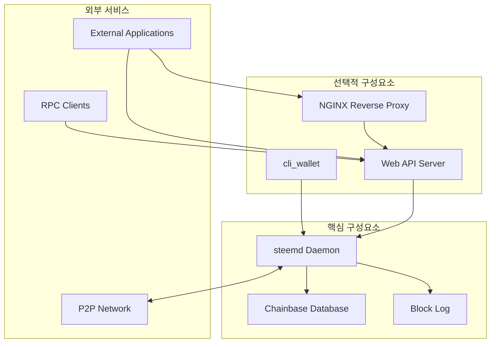

## 노드 유형

### 1. Witness 노드 (블록 생산자)

블록 생성을 위한 최소 구성입니다.

**목적:** 블록 생성, 트랜잭션 검증, 합의 참여

**필수 구성요소:**
- `witness` plugin이 포함된 `steemd`
- Low memory mode 권장

**시스템 요구사항:**
- **CPU:** 2-4 코어 (3+ GHz 권장)
- **RAM:** 최소 4-8 GB
- **스토리지:** 30-50 GB SSD
- **네트워크:** 100 Mbps+ 안정적 연결, 낮은 지연시간

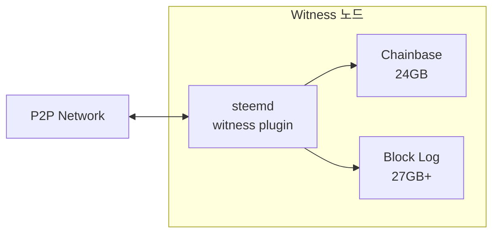

### 2. Seed 노드 (P2P 노드)

네트워크 건전성을 위한 P2P 연결을 제공합니다.

**목적:** 블록 및 트랜잭션 중계, 네트워크 연결성 유지

**필수 구성요소:**
- `p2p` plugin이 포함된 `steemd`
- 리소스 사용량 감소를 위한 최소 plugin

**시스템 요구사항:**
- **CPU:** 2 코어
- **RAM:** 최소 4 GB (state file 24GB)
- **스토리지:** 30-50 GB SSD
- **네트워크:** 1 Gbps+ 권장, 높은 대역폭

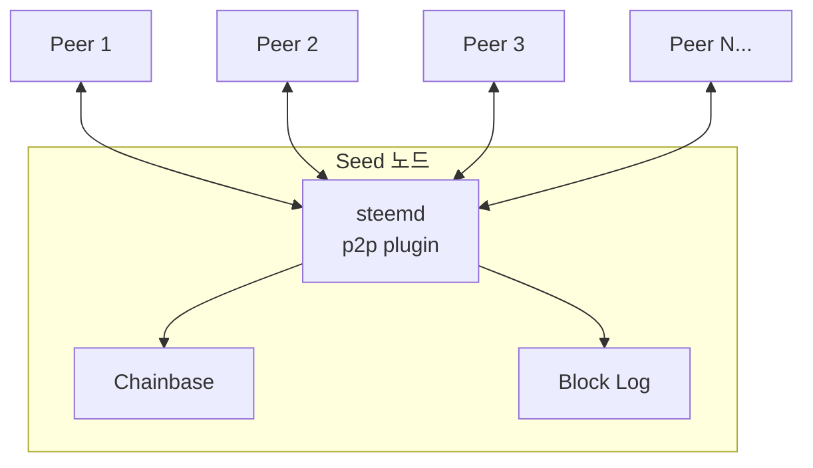

### 3. API 노드 (Full 노드)

애플리케이션을 위한 포괄적인 API 접근을 제공합니다.

**목적:** API 요청 처리, 애플리케이션에 블록체인 데이터 제공

**필수 구성요소:**
- API plugin(`database_api`, `account_history_api`, `follow_api` 등)이 포함된 `steemd`
- HTTP/WebSocket endpoint를 위한 `webserver` plugin
- 선택사항: 로드 밸런싱을 위한 NGINX reverse proxy

**시스템 요구사항:**
- **CPU:** 4-8 코어
- **RAM:** 최소 16-32 GB
- **스토리지:** 110+ GB SSD (NVMe 권장)
- **네트워크:** 1 Gbps+ 권장

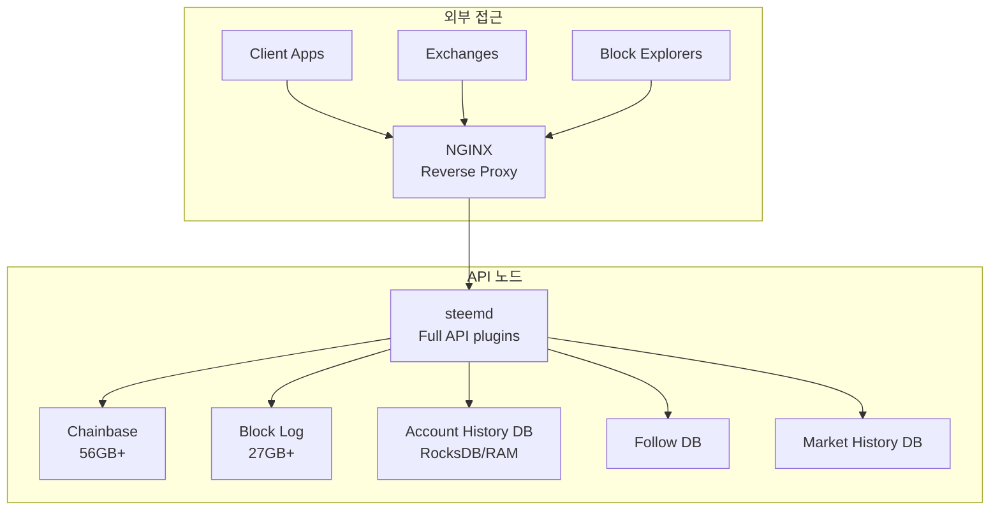

### 4. Exchange 노드

암호화폐 거래소를 위한 특화된 노드입니다.

**목적:** 입출금 모니터링, 계정 잔액 추적

**필수 구성요소:**
- `account_by_key_api`, `database_api`가 포함된 `steemd`
- 효율적인 계정 히스토리 쿼리를 위한 `account_history_rocksdb` plugin
- 트랜잭션 서명을 위한 `cli_wallet`

**시스템 요구사항:**
- **CPU:** 4-8 코어
- **RAM:** 16-32 GB
- **스토리지:** 110+ GB SSD + RocksDB 스토리지
- **네트워크:** 100 Mbps+ 안정적 연결

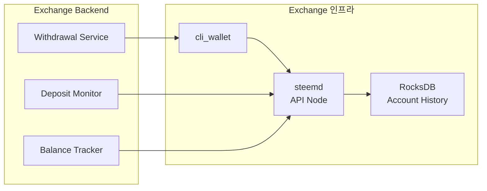

## 최소 하드웨어 요구사항

### 요약 테이블

| 노드 유형 | CPU | RAM | 스토리지 | 네트워크 | 월간 비용 예상 |
|-----------|-----|-----|---------|---------|----------------------|
| Witness 노드 | 2-4 코어 | 4-8 GB | 50 GB SSD | 100 Mbps | $20-50 |
| Seed 노드 | 2 코어 | 4 GB | 50 GB SSD | 1 Gbps | $40-80 |
| API 노드 | 4-8 코어 | 16-32 GB | 110+ GB NVMe | 1 Gbps | $80-200 |
| Exchange 노드 | 4-8 코어 | 16-32 GB | 150+ GB SSD | 100 Mbps | $80-200 |

### 세부 요구사항

#### CPU
- **최소:** x86_64 아키텍처, 2 코어 @ 2.5+ GHz
- **권장:** 4+ 코어 @ 3+ GHz
- **최적:** 트래픽이 많은 API 노드의 경우 8+ 코어
- 암호화 연산을 위한 AVX2 instruction set 지원 권장

#### RAM
- **Witness/Seed 노드:** 최소 4 GB, 8 GB 권장
- **API 노드:** 최소 16 GB, 32+ GB 권장
- **참고:** Memory-mapped state file (최대 80GB 구성)은 가상 메모리를 사용합니다

#### 스토리지
- **타입:** SSD 필수 (API 노드는 NVMe 권장)
- **최소 공간:**
  - Witness/Seed: 50 GB (pruning 시 30 GB)
  - API 노드: 최소 110 GB, 150+ GB 권장
- **IOPS:** sync/replay 작업을 위해 3,000+ IOPS
- **구성요소:**
  - Shared memory file: 56 GB (최대 80 GB 구성)
  - Block log: 27+ GB (지속적으로 증가)
  - RocksDB (활성화 시): 20-50+ GB

#### 네트워크
- **대역폭:**
  - Witness: 최소 100 Mbps
  - Seed: 1 Gbps+ 권장
  - API: 1 Gbps+ 권장
- **지연시간:** 주요 peer까지 <50ms (witness에 중요)
- **포트:**
  - P2P: 2001 (기본값, 변경 가능)
  - WebSocket: 8090 (기본값, 변경 가능)
  - HTTP RPC: 8091 (기본값, 변경 가능)

## 시스템 아키텍처 다이어그램

### 완전한 시스템 데이터 흐름

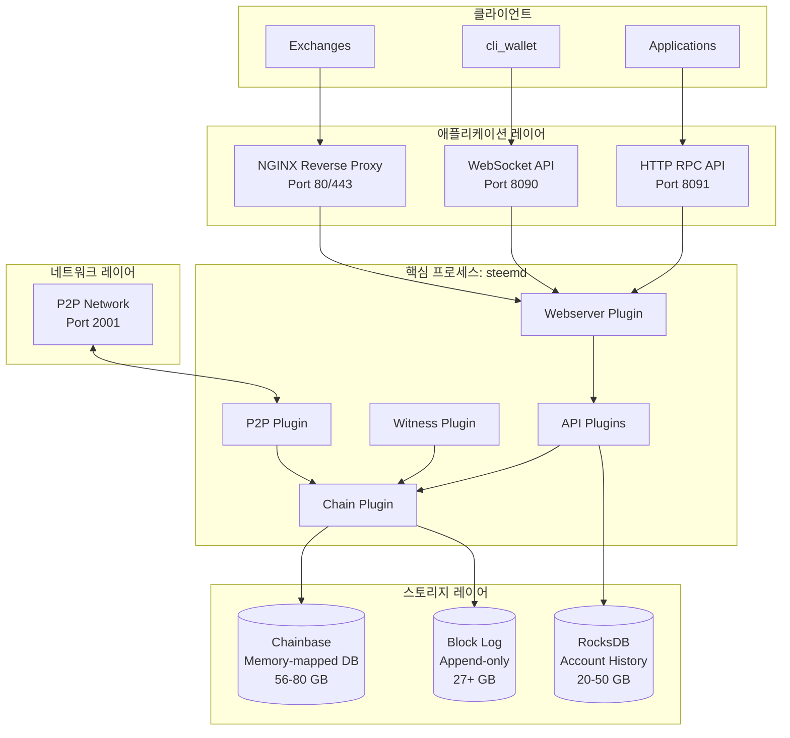

### Plugin 아키텍처

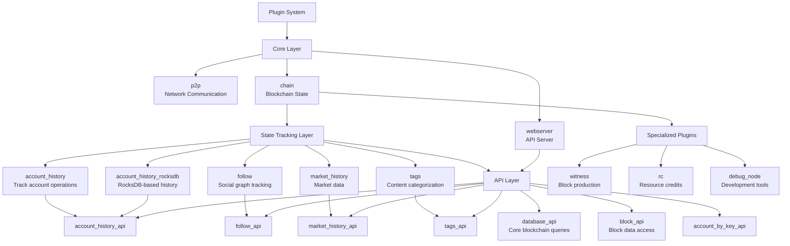

### 메모리 레이아웃

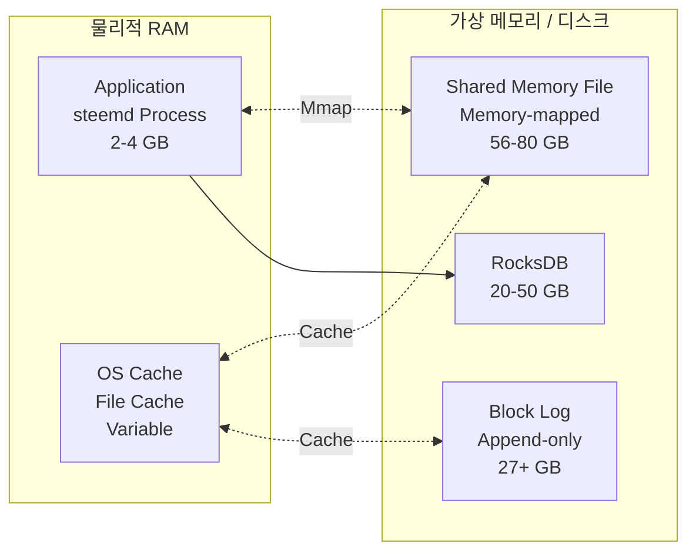

## 네트워크 구성

### 포트 구성

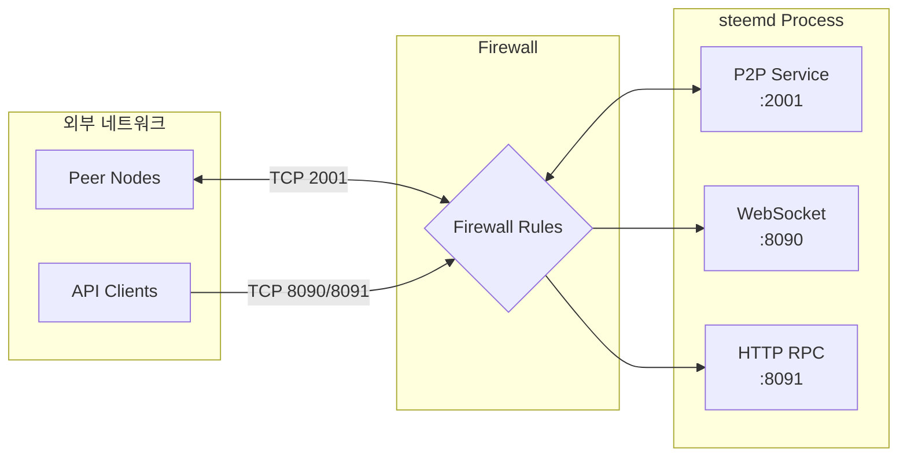

### Firewall 규칙 (iptables 예제)

```bash
# P2P port (모든 노드에 필수)
iptables -A INPUT -p tcp --dport 2001 -j ACCEPT

# WebSocket API (API 노드용)
iptables -A INPUT -p tcp --dport 8090 -j ACCEPT

# HTTP RPC API (API 노드용)
iptables -A INPUT -p tcp --dport 8091 -j ACCEPT

# NGINX reverse proxy (선택사항)
iptables -A INPUT -p tcp --dport 80 -j ACCEPT
iptables -A INPUT -p tcp --dport 443 -j ACCEPT
```

## 스토리지 레이아웃

### 권장 디렉토리 구조

```
/var/lib/steemd/
├── blockchain/
│   ├── block_log              # 불변 블록체인 데이터 (27+ GB)
│   └── block_log.index        # 빠른 조회를 위한 블록 인덱스
├── shared_mem.bin              # Memory-mapped state (56-80 GB)
├── shared_mem.meta             # Shared memory 메타데이터
├── account_history.rocksdb/    # RocksDB account history (선택, 20-50 GB)
└── config.ini                  # 노드 구성
```

### 스토리지 최적화

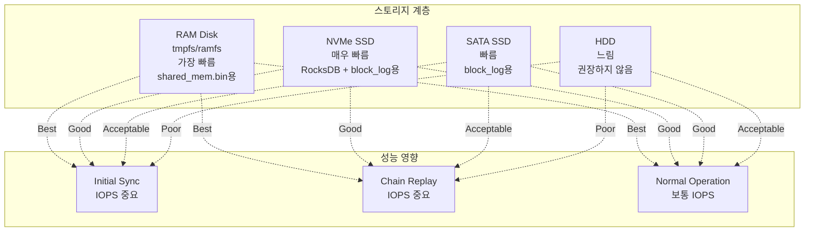

### 최적 성능을 위한 Linux VM 설정

초기 sync 및 chain replay 작업을 위해:

```bash
# Increase dirty background ratio
echo 75 | sudo tee /proc/sys/vm/dirty_background_ratio

# Decrease dirty expire time
echo 1000 | sudo tee /proc/sys/vm/dirty_expire_centisecs

# Increase dirty ratio
echo 80 | sudo tee /proc/sys/vm/dirty_ratio

# Increase dirty writeback time
echo 30000 | sudo tee /proc/sys/vm/dirty_writeback_centisecs
```

## 배포 시나리오

### 시나리오 1: 단일 Witness 노드

블록 생성을 위한 최소 설정입니다.

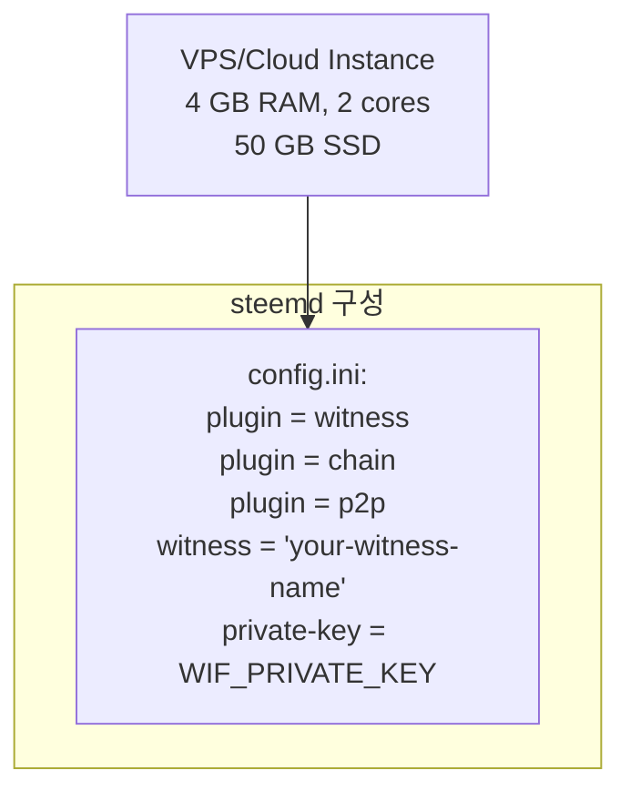

**예상 비용:** $20-50/월

### 시나리오 2: 로드 밸런서를 사용한 API 노드

애플리케이션 서비스를 위한 프로덕션 설정입니다.

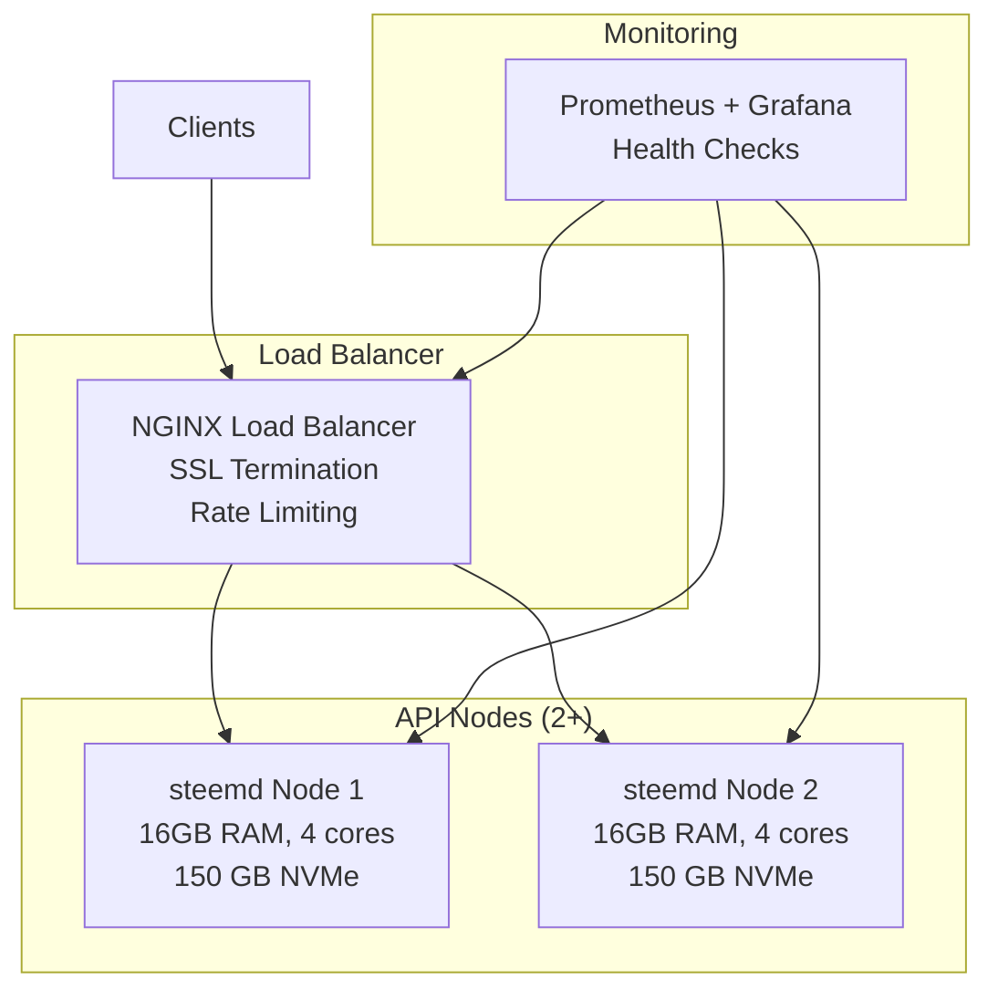

**예상 비용:** $200-500/월

### 시나리오 3: Exchange 인프라

암호화폐 거래소를 위한 전용 설정입니다.

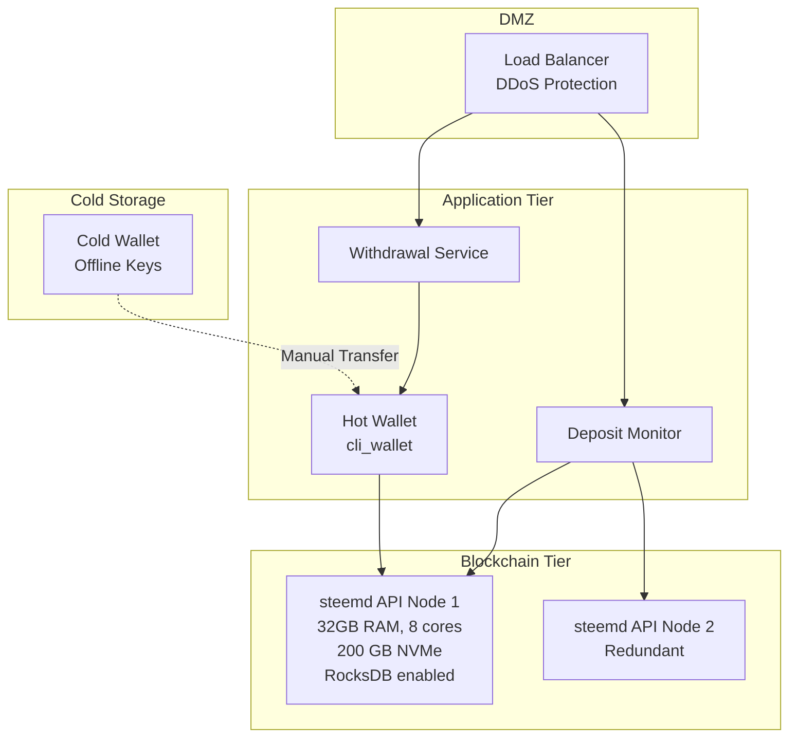

**예상 비용:** $300-800/월 (보안 인프라 제외)

### 시나리오 4: 개발/테스트 환경

개발 및 테스트를 위한 로컬 설정입니다.

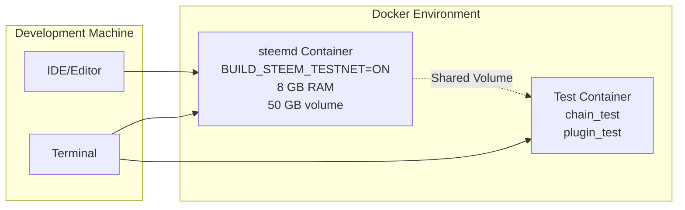

**요구사항:** 8+ GB RAM을 가진 로컬 머신 또는 VM, Docker 설치

## 구성 예제

### Witness 노드 (config.ini)

```ini
# Data directory
data-dir = /var/lib/steemd

# P2P endpoint
p2p-endpoint = 0.0.0.0:2001

# Enable required plugins
plugin = chain p2p witness

# Witness configuration
witness = "your-witness-name"
private-key = 5JYourPrivateKeyInWIFFormat...

# Seed nodes
seed-node = seed-node1.example.com:2001
seed-node = seed-node2.example.com:2001

# Resource optimization
shared-file-size = 24G
shared-file-dir = /var/lib/steemd

# Enable low memory mode
plugin = witness
```

### API 노드 (config.ini)

```ini
# Data directory
data-dir = /var/lib/steemd

# P2P endpoint
p2p-endpoint = 0.0.0.0:2001

# API endpoints
webserver-http-endpoint = 0.0.0.0:8091
webserver-ws-endpoint = 0.0.0.0:8090

# Enable plugins
plugin = chain p2p webserver
plugin = database_api block_api
plugin = account_history_rocksdb account_history_api
plugin = follow follow_api
plugin = market_history market_history_api
plugin = account_by_key_api

# Seed nodes
seed-node = seed-node1.example.com:2001
seed-node = seed-node2.example.com:2001

# Resource configuration
shared-file-size = 80G
shared-file-dir = /var/lib/steemd

# RocksDB configuration
account-history-rocksdb-path = /var/lib/steemd/account_history.rocksdb

# API limits
webserver-thread-pool-size = 32
```

## 모니터링 및 헬스 체크

### 모니터링할 주요 메트릭

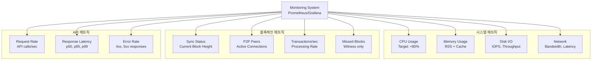

### 헬스 체크 Endpoint

NGINX frontend(`USE_NGINX_FRONTEND=1`)를 사용할 때 다음 endpoint를 사용할 수 있습니다:

- `GET /health` - 기본 헬스 체크 (노드가 응답하면 200)
- `GET /.well-known/healthcheck.json` - 상세 헬스 상태

## 백업 및 재해 복구

### 백업 전략

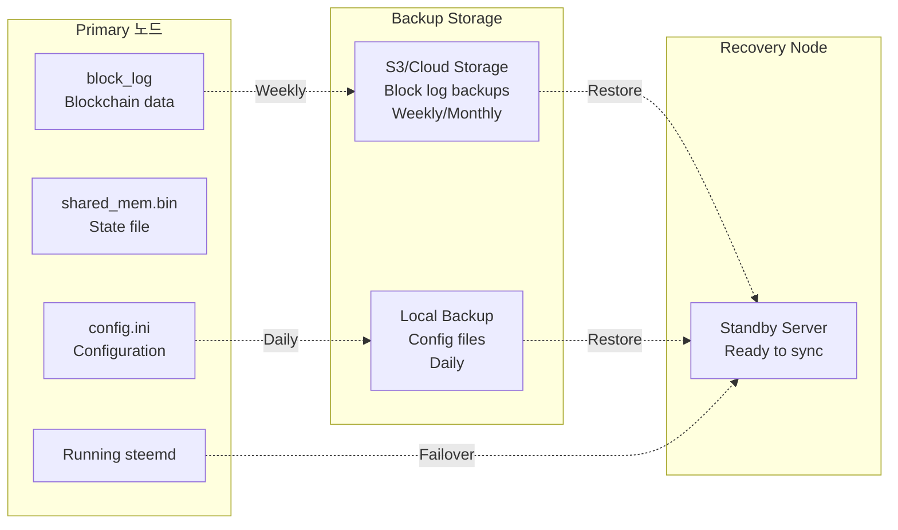

### 복구 옵션

1. **빠른 복구:** S3의 snapshot 사용 + 최근 블록 replay
2. **완전 복구:** genesis부터 또는 신뢰할 수 있는 block log부터 전체 체인 replay
3. **State File 공유:** 사전 동기화된 shared memory file 다운로드 (PaaS mode with `SYNC_TO_S3`)

## 보안 고려사항

### 네트워크 보안

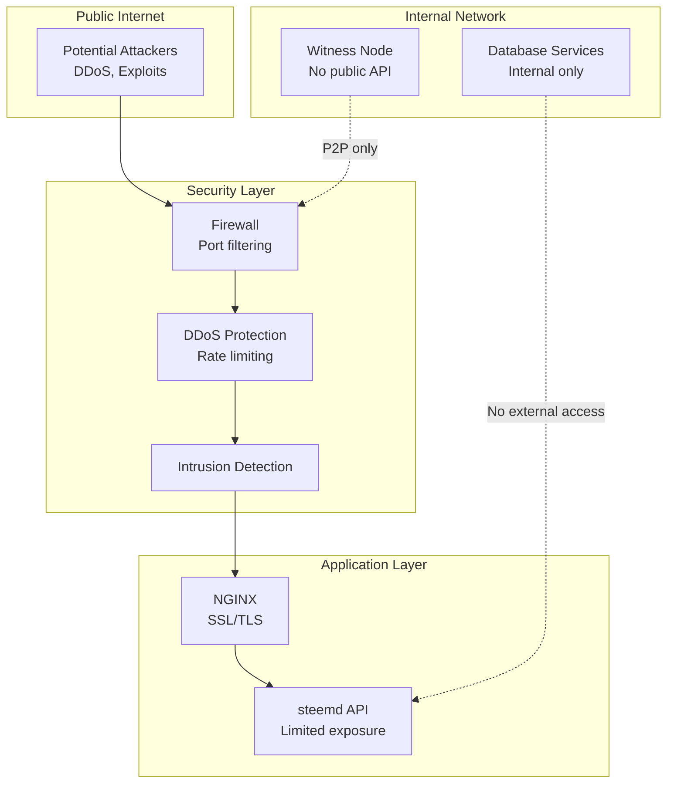

### 모범 사례

1. **Witness 노드:**
   - API endpoint를 공개적으로 노출하지 마십시오
   - Firewall을 사용하여 P2P를 알려진 peer로만 제한하십시오
   - Private key를 암호화하고 안전하게 백업하십시오
   - 놓친 블록을 모니터링하십시오

2. **API 노드:**
   - 유효한 SSL 인증서로 HTTPS/WSS를 사용하십시오
   - 남용 방지를 위해 rate limiting을 구현하십시오
   - Whitelist로 CORS를 신중하게 활성화하십시오
   - 정기적인 보안 업데이트

3. **키 관리:**
   - Witness private key를 암호화하여 저장하십시오
   - 다른 목적(active/posting/owner)으로 별도의 키를 사용하십시오
   - 키 교체 정책을 구현하십시오
   - 버전 관리에 키를 커밋하지 마십시오

## 결론

최소 시스템 구성은 노드 유형에 따라 다릅니다:

- **Witness 노드:** 2-4 코어, 4-8 GB RAM, 50 GB SSD, 안정적인 네트워크
- **Seed 노드:** 2 코어, 4 GB RAM, 50 GB SSD, 높은 대역폭
- **API 노드:** 4-8 코어, 16-32 GB RAM, 110+ GB NVMe SSD, 높은 대역폭
- **Exchange 노드:** 4-8 코어, 16-32 GB RAM, 150+ GB SSD, RocksDB 활성화

항상 SSD 스토리지를 사용하고(API 노드는 NVMe 선호) 적절한 네트워크 연결을 보장하십시오. 프로덕션 배포의 경우 중복성, 모니터링 및 재해 복구 절차를 구현하십시오.

상세한 빌드 지침은 [docs/getting-started/building.md](../getting-started/building.md)를 참조하십시오.
거래소별 설정은 [docs/getting-started/exchange-quick-start.md](../getting-started/exchange-quick-start.md)를 참조하십시오.
