# Steem Blockchain System Architecture

This document describes the minimum system configuration required to operate a Steem blockchain node.

## Table of Contents

1. [System Overview](#system-overview)
2. [Node Types](#node-types)
3. [Minimum Hardware Requirements](#minimum-hardware-requirements)
4. [System Architecture Diagrams](#system-architecture-diagrams)
5. [Network Configuration](#network-configuration)
6. [Storage Layout](#storage-layout)
7. [Deployment Scenarios](#deployment-scenarios)

## System Overview

The Steem blockchain requires different system configurations depending on the node type and use case. The system consists of the core blockchain daemon (`steemd`), optional wallet interface (`cli_wallet`), and various plugins for extended functionality.

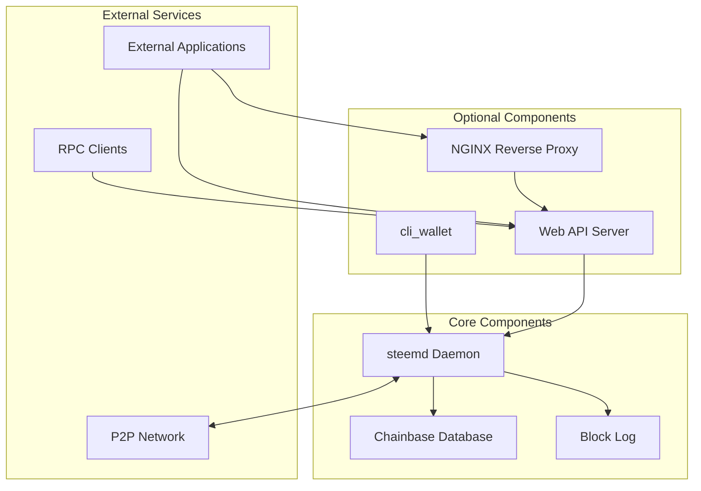

## Node Types

### 1. Witness Node (Block Producer)

Minimal configuration for producing blocks.

**Purpose:** Produce blocks, validate transactions, participate in consensus

**Required Components:**
- `steemd` with `witness` plugin
- Low memory mode recommended

**System Requirements:**
- **CPU:** 2-4 cores (3+ GHz recommended)
- **RAM:** 4-8 GB minimum
- **Storage:** 30-50 GB SSD
- **Network:** 100 Mbps+ stable connection, low latency

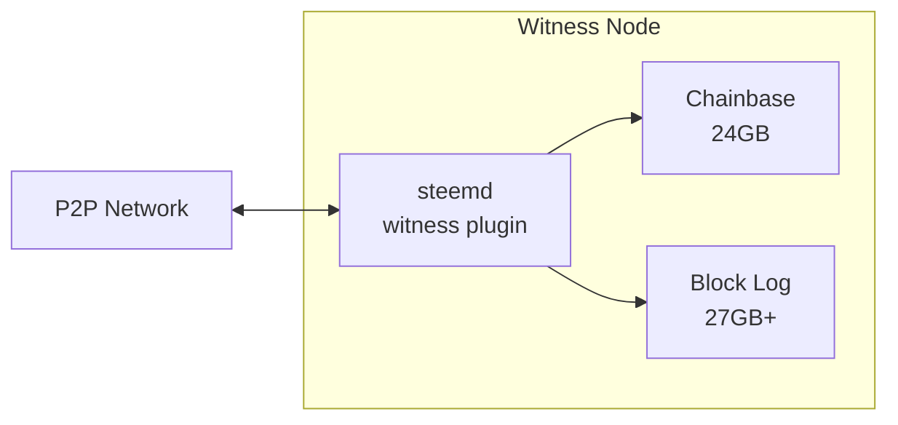

### 2. Seed Node (P2P Node)

Provides P2P connectivity for network health.

**Purpose:** Relay blocks and transactions, maintain network connectivity

**Required Components:**
- `steemd` with `p2p` plugin
- Minimal plugins for reduced resource usage

**System Requirements:**
- **CPU:** 2 cores
- **RAM:** 4 GB minimum (24GB for state file)
- **Storage:** 30-50 GB SSD
- **Network:** 1 Gbps+ recommended, high bandwidth

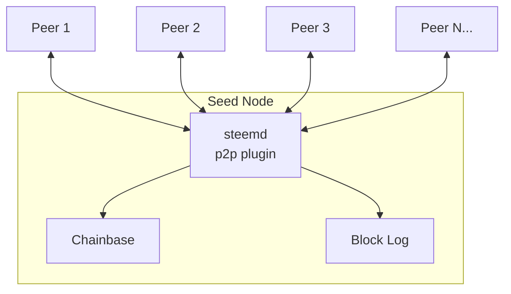

### 3. API Node (Full Node)

Provides comprehensive API access for applications.

**Purpose:** Serve API requests, provide blockchain data to applications

**Required Components:**
- `steemd` with API plugins (`database_api`, `condenser_api`, `account_history_api`, `follow_api`, etc.)
- `webserver` plugin for HTTP/WebSocket endpoints
- Optional: NGINX reverse proxy for load balancing

**System Requirements:**
- **CPU:** 4-8 cores
- **RAM:** 16-32 GB minimum
- **Storage:** 110+ GB SSD (recommended NVMe)
- **Network:** 1 Gbps+ recommended

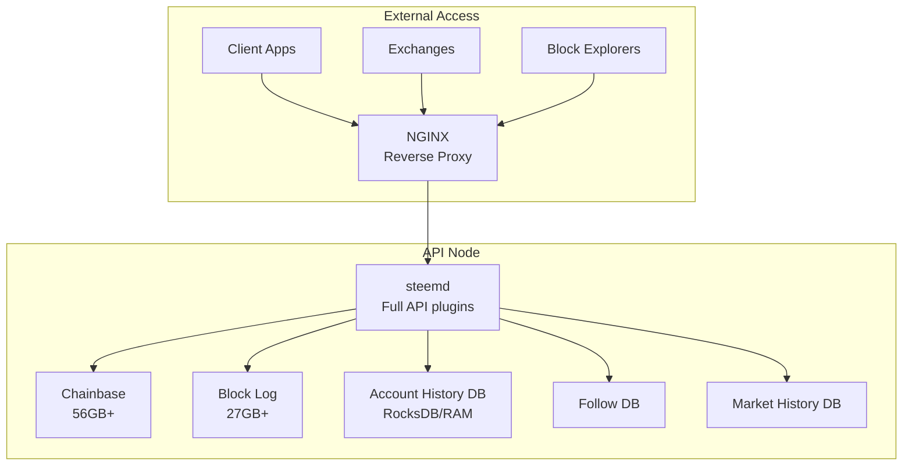

### 4. Exchange Node

Specialized node for cryptocurrency exchanges.

**Purpose:** Monitor deposits/withdrawals, track account balances

**Required Components:**
- `steemd` with `account_by_key_api`, `condenser_api`, `database_api`
- `account_history_rocksdb` plugin for efficient account history queries
- `cli_wallet` for transaction signing

**System Requirements:**
- **CPU:** 4-8 cores
- **RAM:** 16-32 GB
- **Storage:** 110+ GB SSD + RocksDB storage
- **Network:** 100 Mbps+ stable connection

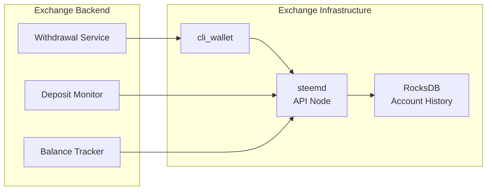

## Minimum Hardware Requirements

### Summary Table

| Node Type | CPU | RAM | Storage | Network | Monthly Cost Estimate |
|-----------|-----|-----|---------|---------|----------------------|
| Witness Node | 2-4 cores | 4-8 GB | 50 GB SSD | 100 Mbps | $20-50 |
| Seed Node | 2 cores | 4 GB | 50 GB SSD | 1 Gbps | $40-80 |
| API Node | 4-8 cores | 16-32 GB | 110+ GB NVMe | 1 Gbps | $80-200 |
| Exchange Node | 4-8 cores | 16-32 GB | 150+ GB SSD | 100 Mbps | $80-200 |

### Detailed Requirements

#### CPU
- **Minimum:** x86_64 architecture, 2 cores @ 2.5+ GHz
- **Recommended:** 4+ cores @ 3+ GHz
- **Optimal:** 8+ cores for API nodes with high traffic
- AVX2 instruction set support recommended for cryptographic operations

#### RAM
- **Witness/Seed Node:** 4 GB minimum, 8 GB recommended
- **API Node:** 16 GB minimum, 32+ GB recommended
- **Note:** Memory-mapped state file (up to 80GB configured) uses virtual memory

#### Storage
- **Type:** SSD required (NVMe recommended for API nodes)
- **Minimum Space:**
  - Witness/Seed: 50 GB (30 GB with pruning)
  - API Node: 110 GB minimum, 150+ GB recommended
- **IOPS:** 3,000+ IOPS for sync/replay operations
- **Components:**
  - Shared memory file: 56 GB (up to 80 GB configured)
  - Block log: 27+ GB (growing continuously)
  - RocksDB (if enabled): 20-50+ GB

#### Network
- **Bandwidth:**
  - Witness: 100 Mbps minimum
  - Seed: 1 Gbps+ recommended
  - API: 1 Gbps+ recommended
- **Latency:** <50ms to major peers (critical for witnesses)
- **Ports:**
  - P2P: 2001 (default, configurable)
  - WebSocket: 8090 (default, configurable)
  - HTTP RPC: 8091 (default, configurable)

## System Architecture Diagrams

### Complete System Data Flow

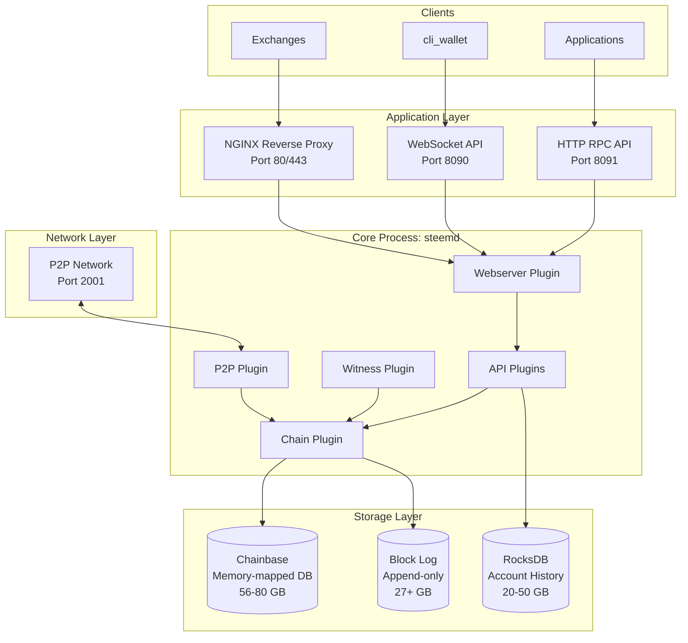

### Plugin Architecture

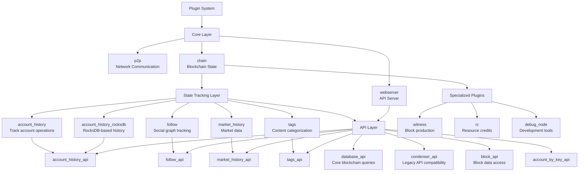

### Memory Layout

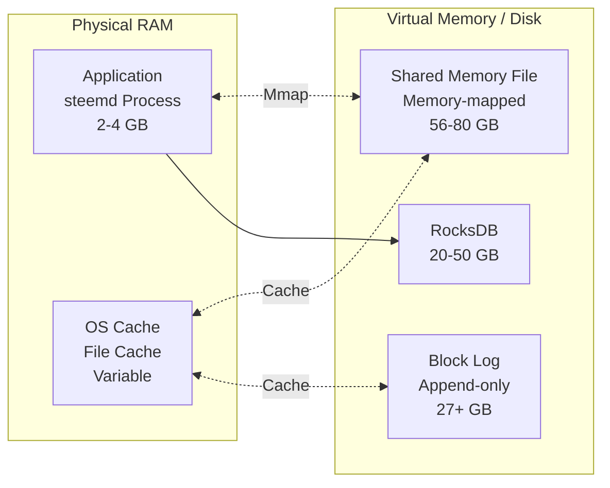

## Network Configuration

### Port Configuration

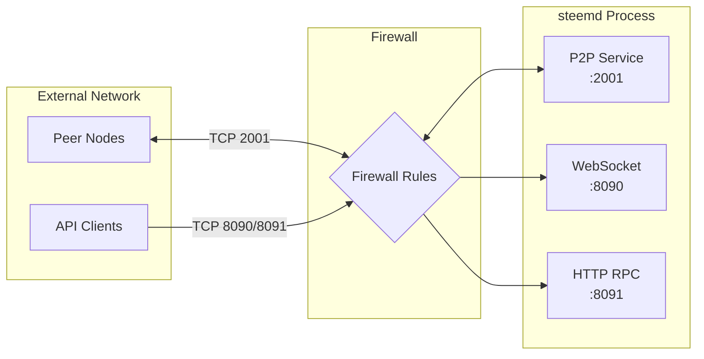

### Firewall Rules (iptables example)

```bash
# P2P port (required for all nodes)
iptables -A INPUT -p tcp --dport 2001 -j ACCEPT

# WebSocket API (for API nodes)
iptables -A INPUT -p tcp --dport 8090 -j ACCEPT

# HTTP RPC API (for API nodes)
iptables -A INPUT -p tcp --dport 8091 -j ACCEPT

# NGINX reverse proxy (optional)
iptables -A INPUT -p tcp --dport 80 -j ACCEPT
iptables -A INPUT -p tcp --dport 443 -j ACCEPT
```

## Storage Layout

### Recommended Directory Structure

```
/var/lib/steemd/
├── blockchain/
│   ├── block_log              # Immutable blockchain data (27+ GB)
│   └── block_log.index        # Block index for fast lookup
├── shared_mem.bin              # Memory-mapped state (56-80 GB)
├── shared_mem.meta             # Metadata for shared memory
├── account_history.rocksdb/    # RocksDB account history (optional, 20-50 GB)
└── config.ini                  # Node configuration
```

### Storage Optimization

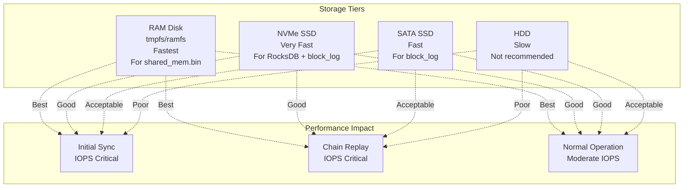

### Linux VM Settings for Optimal Performance

For initial sync and chain replay operations:

```bash
# Increase dirty background ratio
echo 75 | sudo tee /proc/sys/vm/dirty_background_ratio

# Decrease dirty expire time
echo 1000 | sudo tee /proc/sys/vm/dirty_expire_centisecs

# Increase dirty ratio
echo 80 | sudo tee /proc/sys/vm/dirty_ratio

# Increase dirty writeback time
echo 30000 | sudo tee /proc/sys/vm/dirty_writeback_centisecs
```

## Deployment Scenarios

### Scenario 1: Single Witness Node

Minimal setup for block production.

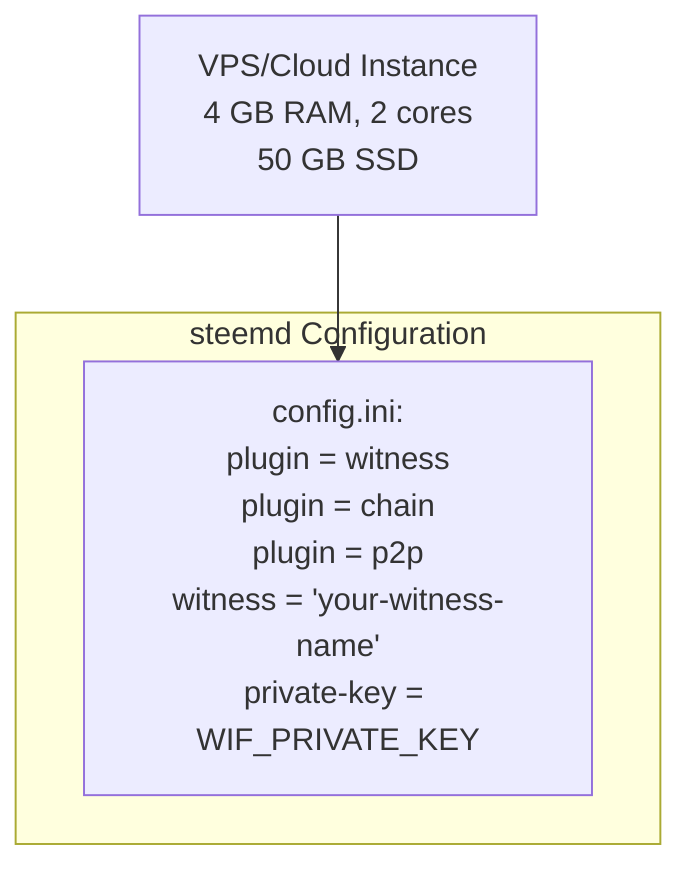

**Estimated Cost:** $20-50/month

### Scenario 2: API Node with Load Balancer

Production setup for serving applications.

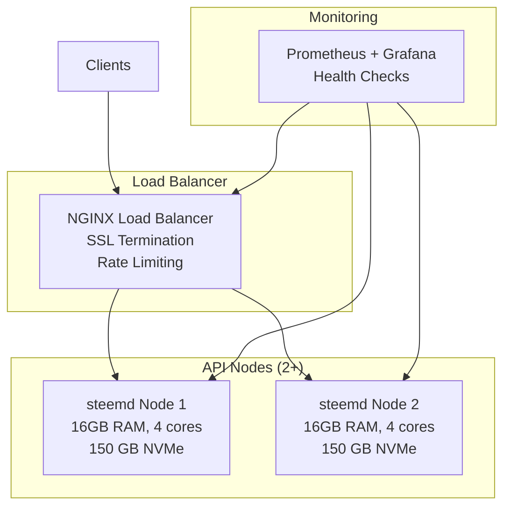

**Estimated Cost:** $200-500/month

### Scenario 3: Exchange Infrastructure

Dedicated setup for cryptocurrency exchanges.

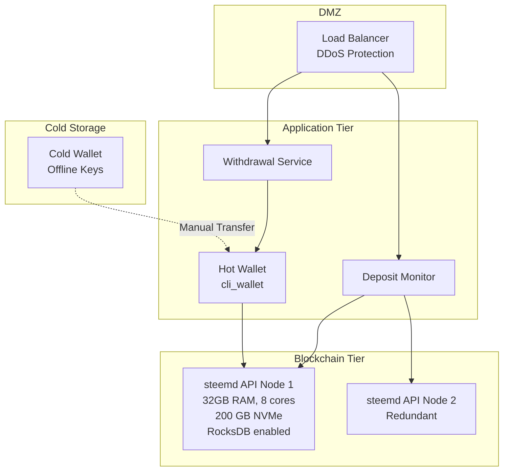

**Estimated Cost:** $300-800/month (excluding security infrastructure)

### Scenario 4: Development/Testing Environment

Local setup for development and testing.

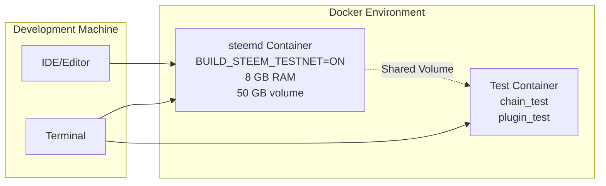

**Requirements:** Local machine or VM with 8+ GB RAM, Docker installed

## Configuration Examples

### Witness Node (config.ini)

```ini
# Data directory
data-dir = /var/lib/steemd

# P2P endpoint
p2p-endpoint = 0.0.0.0:2001

# Enable required plugins
plugin = chain p2p witness

# Witness configuration
witness = "your-witness-name"
private-key = 5JYourPrivateKeyInWIFFormat...

# Seed nodes
seed-node = seed-node1.example.com:2001
seed-node = seed-node2.example.com:2001

# Resource optimization
shared-file-size = 24G
shared-file-dir = /var/lib/steemd

# Enable low memory mode
plugin = witness
```

### API Node (config.ini)

```ini
# Data directory
data-dir = /var/lib/steemd

# P2P endpoint
p2p-endpoint = 0.0.0.0:2001

# API endpoints
webserver-http-endpoint = 0.0.0.0:8091
webserver-ws-endpoint = 0.0.0.0:8090

# Enable plugins
plugin = chain p2p webserver
plugin = database_api condenser_api block_api
plugin = account_history_rocksdb account_history_api
plugin = follow follow_api
plugin = market_history market_history_api
plugin = account_by_key_api

# Seed nodes
seed-node = seed-node1.example.com:2001
seed-node = seed-node2.example.com:2001

# Resource configuration
shared-file-size = 80G
shared-file-dir = /var/lib/steemd

# RocksDB configuration
account-history-rocksdb-path = /var/lib/steemd/account_history.rocksdb

# API limits
webserver-thread-pool-size = 32
```

## Monitoring and Health Checks

### Key Metrics to Monitor

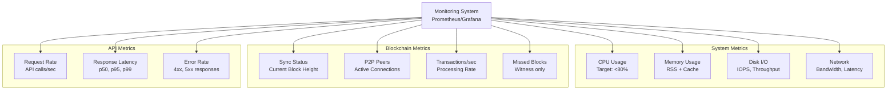

### Health Check Endpoints

When using NGINX frontend (`USE_NGINX_FRONTEND=1`), the following endpoints are available:

- `GET /health` - Basic health check (200 if node is responsive)
- `GET /.well-known/healthcheck.json` - Detailed health status

## Backup and Disaster Recovery

### Backup Strategy

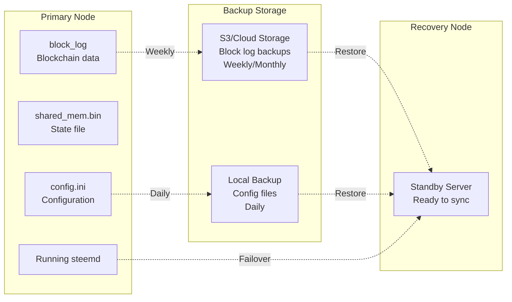

### Recovery Options

1. **Fast Recovery:** Use snapshot from S3 + replay recent blocks
2. **Full Recovery:** Replay entire chain from genesis or trusted block log
3. **State File Sharing:** Download pre-synced shared memory file (PaaS mode with `SYNC_TO_S3`)

## Security Considerations

### Network Security

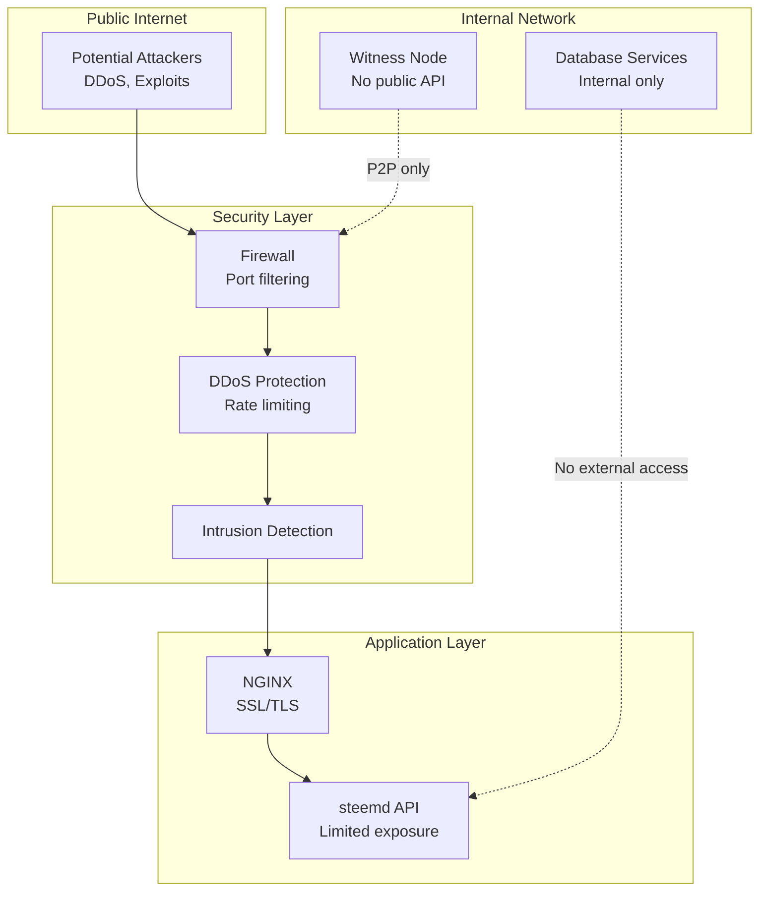

### Best Practices

1. **Witness Nodes:**
   - Do not expose API endpoints publicly
   - Use firewall to restrict P2P to known peers
   - Keep private keys encrypted and backed up securely
   - Monitor for missed blocks

2. **API Nodes:**
   - Use HTTPS/WSS with valid SSL certificates
   - Implement rate limiting to prevent abuse
   - Enable CORS carefully with whitelist
   - Regular security updates

3. **Key Management:**
   - Store witness private keys encrypted
   - Use separate keys for different purposes (active/posting/owner)
   - Implement key rotation policy
   - Never commit keys to version control

## Conclusion

The minimum system configuration depends on the node type:

- **Witness Node:** 2-4 cores, 4-8 GB RAM, 50 GB SSD, reliable network
- **Seed Node:** 2 cores, 4 GB RAM, 50 GB SSD, high bandwidth
- **API Node:** 4-8 cores, 16-32 GB RAM, 110+ GB NVMe SSD, high bandwidth
- **Exchange Node:** 4-8 cores, 16-32 GB RAM, 150+ GB SSD, RocksDB enabled

Always use SSD storage (NVMe preferred for API nodes) and ensure adequate network connectivity. For production deployments, implement redundancy, monitoring, and disaster recovery procedures.

For detailed build instructions, see [docs/getting-started/building.md](../getting-started/building.md).
For exchange-specific setup, see [docs/getting-started/exchange-quick-start.md](../getting-started/exchange-quick-start.md).
